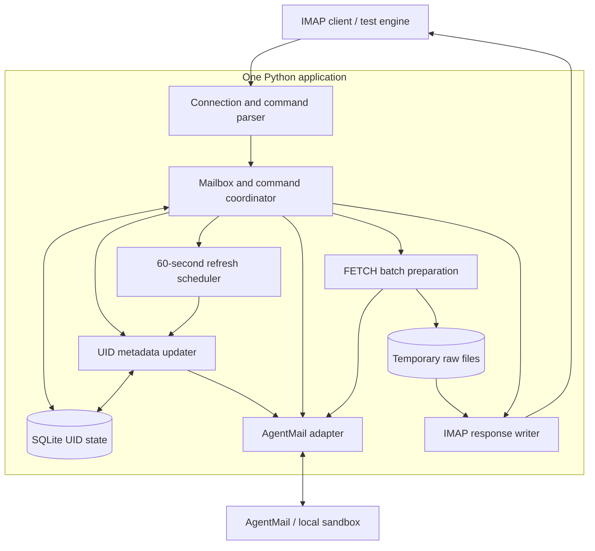
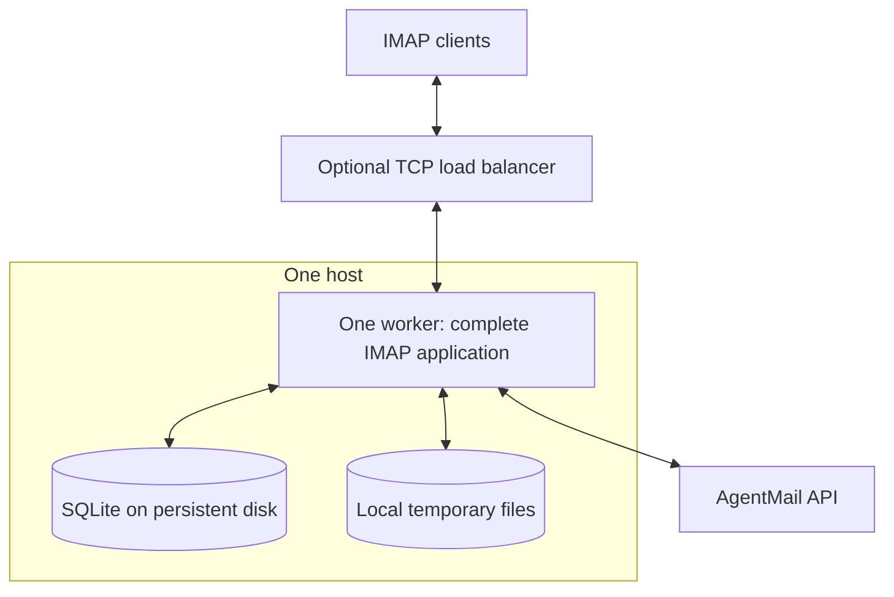
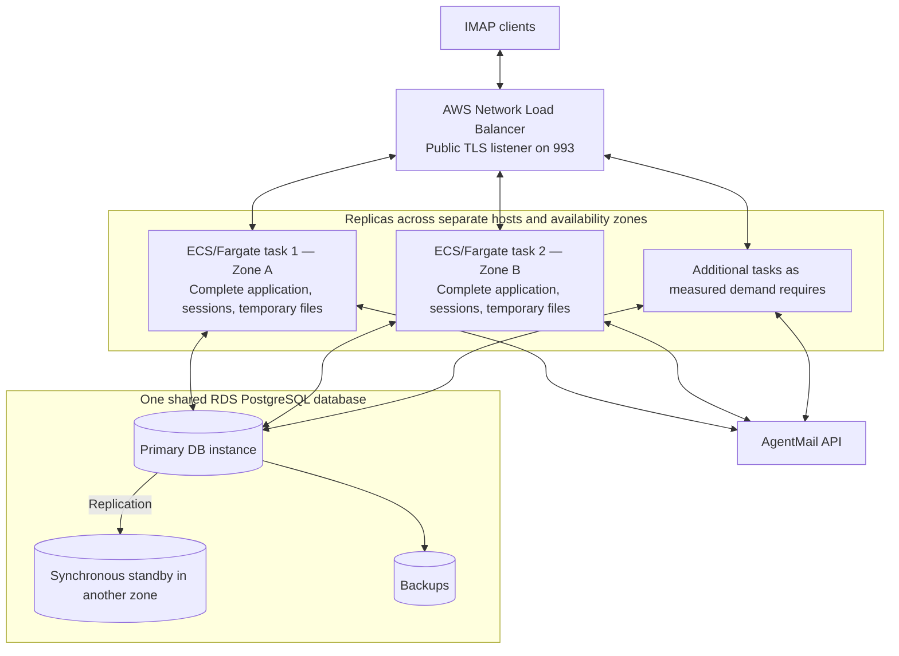

# AgentMail IMAP server — final design and implementation handoff

Finalized September 29, 2026. **Status: ready for implementation.** This standalone handoff defines the local Python server, its acceptance tests, and the future AWS reference architecture. The project server has not been implemented; the disposable Thunderbird capture provides protocol evidence only.

Build an IMAP bridge that lets unmodified Thunderbird authenticate to AgentMail, populate INBOX, retrieve original messages and attachments, and update read state. Persist compact UID mappings, refresh selected mailboxes every 60 seconds by default, and preserve identity across reconnects and restarts. Current implementation and future deployment are separated explicitly below.

### Navigation

- [Agreed decisions and receiving-engine instructions](#1-instructions-for-the-receiving-engine)
- [Scope and completion criteria](#2-scope-and-completion-criteria)
- [Repository and sandbox facts](#3-repository-and-sandbox-facts)
- [Architecture diagrams](#4-architecture-and-component-responsibilities)
- [Implementation structure and dependencies](#5-suggested-implementation-structure-and-dependencies)
- [Authentication and API requests](#6-authentication-authorization-and-api-contract)
- [Protocol and session behavior](#7-protocol-surface-and-session-behavior)
- [Synchronization, caching, and UIDs](#8-mailbox-synchronization-and-durable-uid-state)
- [FETCH and read-state updates](#9-fetch-raw-contents-and-read-state-updates)
- [Failures and confirmation](#10-failure-handling-and-delivery-confirmation)
- [Concurrency and resource limits](#11-concurrency-limits-cleanup-and-observability)
- [NOOP and liveness](#12-noop-liveness-and-idle-connections)
- [Milestones and acceptance tests](#13-five-implementation-milestones-and-exit-tests)
- [Repeatable smoke test](#14-repeatable-end-to-end-smoke-test-specification)
- [Setup and README requirements](#15-proposed-setup-interface-and-final-readme-contents)
- [Future AWS deployment and capacity](#16-future-aws-deployment-and-capacity)
- [Implementation checkpoints](#17-implementation-checkpoints)
- [Final checklist](#18-final-handoff-checklist)

## 1. Instructions for the receiving engine

Build a local Python IMAP server over the public AgentMail API. The primary user experience is **connect an unmodified Thunderbird client → authenticate → populate INBOX → open messages and attachments → update read/unread state → reconnect reliably**. Keep scripted login/read/logout as an automated check, not an assumption about the real client's requests. Complete the five milestones below in order, including the expanded reading/read-state protocol contract in section 7.

The user removed the assignment's two-day constraint. Prioritize correctness and a clear design. Do not add production infrastructure to the implementation: AWS and distributed operation belong in the architecture discussion only.

Treat the decisions marked **agreed** as settled. The recommendations in this document make the design concrete but do not pretend that the user chose every parser detail, numeric limit, or dependency version. Resolve routine implementation details and document them. Ask focused questions for material changes to scope or semantics; the user wants design participation but dislikes unnecessary complexity and repeated confirmation.

No further product decision is required to begin milestone 1. Section 17 assigns technical verification and default selection to the implementing engine; those checkpoints are not a reason to restart planning. Complete the local milestones before undertaking a separately authorized deployment.

Use this plan together with the repository assignment and public API documentation. If a proposed behavior contradicts a protocol requirement, explain the conflict and implement/document a correct supported subset. Do not infer the meaning of isolated historical answers such as “Option A”; the explicit decisions below are the handoff record.

### Agreed decisions

| Topic | Decision |
| --- | --- |
| Implementation | Python, asynchronous connection handling, official async AgentMail SDK, SQLite locally. |
| Client contract | Thunderbird is an unmodified black box. Handle incoming commands correctly under the chosen protocol and advertised capabilities; no prescribed client sequence. |
| Allowed changes | Read/unread state only. Deny message moves/copies/deletion, folder changes, uploads, and other excluded mutations explicitly. |
| Session identity | One inbox per connection. Multiple connections may access the same inbox. |
| Authentication | IMAP username is the inbox ID; IMAP password is the API key. Validate against AgentMail. |
| Revocation | Fresh authorization before mailbox commands and before each returned email; extra requests are acceptable. |
| SDK behavior | Preserve **two retries and a 60-second timeout**. Do not add another retry layer now. |
| INBOX membership | Include every accessible message labeled `received`, including received messages also labeled trash/spam. Sent-only and trash-only messages are excluded. |
| Durable state | Persist mailbox-scoped UID ↔ AgentMail message-ID mappings and mailbox counters even with no connections open. Preserve UIDs across reconnects/restarts; arrivals never renumber existing UIDs or reuse allocated values. No persistent email contents. |
| Metadata updater | Reconcile paginated AgentMail listings with durable mappings and prepare a complete candidate session view. LOGIN does not enumerate messages. |
| Metadata refresh | Refresh every 60 seconds by default while INBOX is selected; make the interval configurable. Also refresh on SELECT, EXAMINE, and selected-session NOOP. STATUS obtains appropriate state without changing the selection. |
| Key visibility | First version assumes keys for the same inbox expose the same message set. Credentials remain isolated and freshly authorized; no support for arbitrary different subsets is promised. |
| Thunderbird acceptance settings | Download headers first and retrieve contents when opened. Full offline download is not the initial acceptance workflow. |
| UID database recovery | Stop affected mailbox operations on loss/corruption until explicit recovery or reset. Include durable commits, consistent backups, and restore verification; no automatic identity rebuild. |
| FETCH preparation | Prepare the **entire requested batch** before returning any email data. |
| Contents | Temporary raw email files during a request; no persistent body or attachment cache. |
| Read state | PEEK preserves read state. Non-PEEK retrieval follows selection mode. Support explicit STORE/UID STORE changes to Seen, including marking unread. |
| Preparation failure | Return a command failure before sending bodies; discard incomplete work. |
| Testing | Own protocol tests, raw TCP and Python `imaplib`, an isolated repeatable end-to-end smoke test, and actual Thunderbird reading/read-state acceptance. |
| Future capacity | Discuss growth from 1 to 10,000 concurrent connections. No request-rate target or workload mix is established. |
| Deployment | Future AWS direction only. No deployment work in this submission. |
| AWS reference architecture | Two complete application replicas across two Availability Zones, one NLB, and shared RDS PostgreSQL with a primary and standby. ECS/Fargate is the recommended hosting choice; counts establish a redundancy baseline, not a capacity guarantee. |

## 2. Scope and completion criteria

### Implement now

- Local TCP listener, normally `127.0.0.1:1143`.
- Authentication, discovery, selection, reading, search, read-state updates, and lifecycle commands for correct black-box Thunderbird operation, as defined in section 7.
- Complete mailbox pagination, durable UIDs, exact raw message retrieval, and read-state handling.
- Periodic metadata refresh for selected mailboxes, with per-session notification queues and bounded scheduling.
- Concurrent local sessions with isolated credentials and snapshots.
- Bounded resource use, cancellation, cleanup, and controlled error responses.
- Automated tests, one-command startup, one-command isolated smoke test, and a final README.

### Explicitly excluded

- Drafts, `APPEND`, SMTP/sending, TLS/STARTTLS, deployment, and production compatibility.
- Thunderbird's sending, draft, deletion, moving/copying, and folder-editing workflows. Reading/read-state compatibility is required; this does not authorize production-account access or promise every optional IMAP extension.
- A distributed database, AWS resources, Kubernetes, Redis, message brokers, distributed download services, or a persistent email-content cache.
- Custom retries beyond the SDK, AgentMail event subscriptions, the optional IMAP IDLE extension, and a custom client delivery-ACK protocol. Periodic REST metadata refresh is included; it does not imply those additional features.
- A library that implements the IMAP server or protocol core. Using `imaplib` as an independent **test client** is appropriate.

The assignment's small command list is an initial development path, not the final compatibility boundary. The user's later black-box client requirement takes precedence. Optional extensions beyond the required reading/read-state contract remain later decisions.

### Definition of done

A fresh checkout can install dependencies, explicitly initialize the UID database, start the sandbox and server using documented commands, authenticate, select the complete received-message view, fetch metadata and exact raw bytes, preserve UIDs through restart, update read state correctly, and log out. Automated tests demonstrate periodic refresh, safe notification timing, errors, concurrency, restart persistence, explicit database recovery, and cleanup. Documentation states supported syntax and limitations accurately. No real credentials or raw authorization headers enter source control or logs.

An unmodified Thunderbird client must also populate INBOX, open messages and attachments, mark messages read/unread, and reconnect without identity confusion. Excluded mutation commands must fail explicitly without side effects. The scripted smoke test alone does not establish this acceptance result.

## 3. Repository and sandbox facts

Original workspace: `/Users/work/Desktop/imap-work-trial`. Paths in this document's code examples are relative to the repository root unless stated otherwise.

Read these existing files before implementation:

- `ASSIGNMENT.md`: required outcome, rules, exclusions. Its two-day schedule has been superseded by the user.
- `API_RESOURCES.md`: public API and protocol references.
- `MANUAL_SMOKE_TEST.md`: local TCP example and requirement for a repeatable final smoke test.
- `STANDARD_IMAP_CLIENT.md`: supplied local Thunderbird settings; its original optional status is superseded by the user's reading/read-state acceptance requirement.
- `.env.example` and `.gitignore`: existing configuration and exclusions.
- `test-harness/README.md`, `test-harness/package.json`.
- `test-harness/fake-agentmail-api.mjs`: exact fake API behavior and test controls.
- `test-harness/lib/fixtures.mjs`: independent raw-byte fixtures.
- `test-harness/tests/fake-agentmail-api.test.mjs`: the sandbox's own five tests.

At finalization, the repository contains starter documentation, the Node sandbox, this plan, and synthetic Thunderbird capture artifacts. It has no project server implementation. The sandbox's five tests passed earlier in planning; they were not re-run merely to finalize this document. Those tests validate the fake API, not our future IMAP server. The disposable capture used PREAUTH and did not call AgentMail. Inspect current files and running processes before assuming earlier runtime state still exists.

### Existing working sandbox commands

```sh
npm --prefix test-harness run api
npm --prefix test-harness test
```

Node.js 20 or newer is required; the sandbox has no third-party dependencies.

Existing synthetic configuration:

```ini
AGENTMAIL_API_URL=http://127.0.0.1:3210/v0
AGENTMAIL_INBOX_ID=candidate@imap.test
AGENTMAIL_API_KEY=test_agentmail_key
IMAP_HOST=127.0.0.1
IMAP_PORT=1143
IMAP_REFRESH_INTERVAL_SECONDS=60
```

These are the supplied fake credentials; `IMAP_REFRESH_INTERVAL_SECONDS` is the proposed configuration name for the agreed 60-second refresh default. `AGENTMAIL_API_KEY` and `AGENTMAIL_INBOX_ID` are useful for the test client; they must never make the server accept an unrelated password or substitute a server-wide key for a client's key. Keep real credentials out of committed files. Default runtime traffic to the local sandbox.

Python 3.12 was previously found at `/Users/work/.local/bin/python3.12`; the machine's default `python3` was 3.9.6. Verify the interpreter rather than assuming `python3` points to the intended version. Recommend Python 3.12+ for this project and declare the actual supported version.

### Fixture membership and pagination

| Fixture ID | Labels | In the agreed INBOX view? |
| --- | --- | --- |
| `msg_received_ascii` | received, unread | Yes |
| `msg_received_utf8` | received, read, starred | Yes |
| `msg_received_attachment` | received, unread | Yes |
| `msg_sent` | sent, read | No |
| `msg_trash` | trash, read | No |
| `msg_multi_label` | received, trash, unread | Yes |
| `msg_new_arrival` | received, unread | Yes, after test insertion |

The baseline contains **six total messages and four received messages**. The API caps a page at **two messages**, even with `limit=100`. Four received messages therefore require two pages. Adding the arrival produces five received messages and requires three pages.

With an explicit `labels` filter, this fake API requires every requested label and bypasses its default trash/spam exclusion. Its default order is descending timestamp; `ascending=true` changes that. The `count` field is the current page's count, not proof of the mailbox's total size. Follow `next_page_token` until absent.

### Available test controls

These routes belong to the fake API and must never be called by the normal IMAP application:

| Route | Purpose |
| --- | --- |
| `GET /health` | Sandbox readiness. |
| `POST /_test/reset` | Reset fixtures, injected failures, and request history. |
| `POST /_test/add-message` | Insert the deterministic arrival; repeated calls replace the same ID. |
| `POST /_test/fail-next` | Inject matching failures with `method`, `path_prefix`, `status`, `delay_ms`, and `times`. |
| `GET /_test/requests` | Inspect the last 100 requests; includes auth presence, not secret header values. |
| `GET /_test/state` | Inspect message metadata, labels, and raw SHA-256 values. Includes text but not the raw RFC822 buffer. |

Failure matching ignores query parameters and matches a normalized path prefix. A one-off 503 may be hidden by SDK retries; inject enough failures to exhaust the retry limit when testing terminal failure. To fail a particular later page, simulate different keys, truncate a stream, or model two inboxes, use purpose-built test doubles or additional isolated test fixtures. The supplied sandbox does not model all of those cases.

A manually started sandbox may already be running on port 3210. The isolated smoke test must not reset or kill a service it did not start.

## 4. Architecture and component responsibilities

### Logical modules inside one application



| Component | Responsibility and invariant |
| --- | --- |
| Connection/parser | Read bounded CRLF command lines, validate syntax, retain tags, enforce session state, serialize commands per connection. |
| Coordinator | Authenticate, bind one inbox, invoke the metadata updater, resolve UID sets, coordinate preparation and emission. Never authorize from cached metadata alone. |
| UID metadata updater | Page through the authorized mailbox view, compare IDs, confirm candidate removals, and coordinate durable UID allocation/retirement. Run on selection, selected-session NOOP, and the periodic scheduler. Prepare changes without silently changing a client's sequence numbers. |
| Refresh scheduler | Track selected mailbox/credential groups in memory, invoke bounded refreshes periodically, prevent overlapping scans, and stop a group's timer when its final selection ends. Queue results through each session's writer. |
| AgentMail adapter | Use the session credential for public API calls, handle pagination/downloads/label updates, classify errors, and expose small application-specific result types. |
| UID repository | Support lookups in both directions, allocate stable mailbox-scoped identifiers, and retain counters while clients are disconnected. Resolve concurrent allocation through transactions and uniqueness constraints; retired UIDs cannot become active again. |
| Batch preparer | Stage all requested contents successfully before any FETCH data is emitted. Enforce file and aggregate resource limits. |
| Response writer | Frame byte-counted literals, write exact contents, apply backpressure, and write one successful completion only after all results. |
| Session snapshot | Hold ordered IDs/UIDs and necessary flags, timestamps, and sizes for that connection only. Publish a refresh as a complete unit. |
| Temporary storage | Own per-request files and cleanup. A staged file is disposable request state, not durable mailbox data. |

These are ordinary modules calling each other inside one process, not separate network services.

### Minimal future deployment shape

For local work the client connects directly to the worker. The load balancer below illustrates an eventual entry point, not something to deploy now.



This supports many connections in one worker, but it has one worker/host as an availability failure point. Persistent disk can survive process restarts; it does not by itself provide replicated storage or host failover. An internet-facing demonstration also needs TLS; section 16 describes the public deployment requirements.

### Intended distributed direction — documentation only



The load balancer selects a worker when the TCP connection opens, before the IMAP username is known. That worker later binds the session to the inbox supplied at LOGIN. Any worker can serve any authorized inbox, and two sessions for one inbox can use different workers. The connection remains on one worker throughout its life. This matches [AWS NLB connection routing](https://docs.aws.amazon.com/elasticloadbalancing/latest/network/).

Each worker contains the whole application. Do not provision one container per inbox or one independent UID database per replica. In the future AWS reference architecture, PostgreSQL coordinates identifiers across workers. Use the [RDS Multi-AZ DB instance deployment](https://docs.aws.amazon.com/AmazonRDS/latest/UserGuide/Concepts.MultiAZSingleStandby.html) with one primary and one standby, plus backups. Additional workers are driven by measurements; section 16 defines the starting counts and prerequisites.

Worker failure loses its sockets, credentials, snapshots, and prepared files. Clients reconnect and reauthenticate elsewhere, then retry incomplete reads using persistent UID identity. Existing TCP sessions do not migrate transparently. Scaling out mainly helps new connections; scaling in requires stopping new assignments and draining sessions with a defined eventual deadline.

## 5. Suggested implementation structure and dependencies

The filenames below are proposed, not existing implementation files:

```text
pyproject.toml
src/agentmail_imap/
    __init__.py
    __main__.py          # CLI/startup/shutdown
    config.py            # validated settings
    server.py            # listener and connection lifecycle
    protocol.py          # tokenizer, command parsing, response encoding
    session.py           # state and per-connection identity/snapshot
    agentmail_adapter.py # public API and raw download boundary
    mailbox.py           # UID metadata updater: pagination, reconciliation, session changes
    refresh_scheduler.py # periodic refreshes for selected mailbox/credential groups
    uid_store.py         # SQLite schema and transactional allocation
    fetch.py             # batch preparation, read-state update coordination
    mime_sections.py     # exact header/part extraction and MIME metadata
    search.py            # base IMAP search evaluation
    flags.py             # Seen-only STORE semantics and upstream labels
    temp_storage.py     # byte limits, file ownership, cleanup
tests/
    ...                 # focused unit and integration tests
scripts/
    smoke_test.py       # starts and cleans up its own services
```

Use `asyncio` streams for sockets, `sqlite3` behind a small repository, and `AsyncAgentMail` for API calls. Use a maintained async HTTP client such as the SDK's HTTP dependency for streaming the returned raw download URL. Explicitly declare any dependency imported directly. `python-dotenv` is optional convenience; environment variables remain the configuration interface.

Choose and pin a tested SDK release during implementation. Confirm its method signatures and resource cleanup API. The current source uses an `AgentMailEnvironment` whose HTTP root excludes `/v0`; generated API routes supply that prefix. Adapt the supplied URL without accidentally producing `/v0/v0/...`. Verify the resulting request paths against the sandbox. See [SDK client source](https://raw.githubusercontent.com/agentmail-to/agentmail-python/main/src/agentmail/client.py) and [environment source](https://raw.githubusercontent.com/agentmail-to/agentmail-python/main/src/agentmail/environment.py).

Preserve the SDK's **default retry limit of 2 and default timeout of 60 seconds**. These are per-request SDK settings, not a total command deadline. Pagination and repeated calls can take longer. If supplying a custom HTTP client, configure it so it does not silently replace the agreed timeout with a different default. Raw URL download policy must be explicit too; do not accidentally introduce custom download retries. [Official SDK documentation](https://github.com/agentmail-to/agentmail-python#advanced)

Short SQLite operations and potentially slow filesystem operations must not stall unrelated sessions. A serialized database worker/thread is a reasonable small implementation. Do not share one `sqlite3` connection unsafely across arbitrary threads. No network await occurs inside a UID allocation transaction.

## 6. Authentication, authorization, and API contract

### Login flow

1. Parse the inbox ID and key supplied by LOGIN.
2. Construct a session-bound API client using that exact key and the configured API environment.
3. Validate identity/scope if using `/auth/me`, and validate access to the requested inbox and its messages with actual read endpoints.
4. On success bind the connection permanently to that inbox. A second LOGIN does not switch it to another inbox.
5. Keep the key only in session memory; drop references and close owned clients when the session closes.

Recommended validation sequence: `auth.me()` for identity context, `inboxes.get(inbox_id)` for inbox access, and a small message-list request to verify message-read access. Identity alone is insufficient. An inbox-scoped credential must match the requested inbox; a broader credential may serve the requested inbox only if the actual API access succeeds.

`GET /v0/auth/me` is publicly documented and returns scope and organization information, with optional inbox/pod/key IDs. It is not a full permissions inventory. [Who Am I API](https://docs.agentmail.to/api-reference/auth/me)

A successful inbox read does not establish message-read or message-update permission. Label visibility can also hide individual messages; inaccessible items may appear as 404. Preserve upstream access boundaries and do not expose shared cached data to a weaker credential. [AgentMail permissions](https://docs.agentmail.to/permissions)

### Fresh checks and the revocation promise

- Before an authenticated mailbox operation, make an appropriate fresh API access check. A fresh listing can serve as the read check for a refresh; avoid redundant calls without a reason.
- Immediately before returning each email/FETCH result, revalidate access to that specific message. A fresh raw-metadata request is a candidate small check; verify the chosen endpoint's permission behavior.
- Never treat an existing temporary file, previously issued download URL, or UID mapping as authorization.
- Confirmed invalid credentials or loss of required inbox/message access stop further data and close the session. Before authentication, send a failed LOGIN completion and close according to this project's chosen policy. Temporary API errors may leave the connection available for another command.
- Permission denial for an optional mutation is not automatically proof that read access was revoked. For example, a key may still support PEEK after a label update is denied.
- The user prefers prompt revocation over avoiding API calls. However, enforcement is bounded by API visibility, checks, and bytes already in flight. Do not promise zero-latency revocation, a mid-message continuous permission monitor, or recovery of bytes already sent.

`CAPABILITY`, unauthenticated `NOOP`, and `LOGOUT` must not require a selected mailbox or an unnecessary upstream lookup.

### API endpoints needed

All paths below are relative to the configured `/v0` API base unless otherwise noted. Supply bearer authorization to the API using the session key. URL-encode IDs as path components.

| Operation | Endpoint / relevant fields |
| --- | --- |
| Identity, if used | `GET /auth/me`: scope and organization identity. |
| Inbox access | `GET /inboxes/{inbox_id}`. |
| Mailbox listing | `GET /inboxes/{inbox_id}/messages`: `labels`, `limit`, `page_token`, optional ordering/visibility parameters; response `messages`, `next_page_token`. |
| Message metadata, if needed | `GET /inboxes/{inbox_id}/messages/{message_id}`. The fake response includes text; do not retain it as a body cache. |
| Raw metadata | `GET /inboxes/{inbox_id}/messages/{message_id}/raw`: sandbox returns `message_id`, `size`, `download_url`, `expires_at`. |
| Raw bytes | GET the returned URL exactly as documented. In the sandbox this is `/raw/{message_id}` outside `/v0`. |
| Mark read | `PATCH /inboxes/{inbox_id}/messages/{message_id}` with `add_labels: ["read"]`, `remove_labels: ["unread"]`. |
| Mark unread | The same PATCH endpoint with `add_labels: ["unread"]`, `remove_labels: ["read"]`. |

Public references: [list messages](https://docs.agentmail.to/api-reference/inboxes/messages/list), [update message](https://docs.agentmail.to/api-reference/inboxes/messages/update). The raw-message documentation route repeatedly failed to load during planning, but the two-step shape was verified against the sandbox and the official SDK's [endpoint implementation](https://github.com/agentmail-to/agentmail-python/blob/main/src/agentmail/inboxes/messages/raw_client.py) and [raw response type](https://github.com/agentmail-to/agentmail-python/blob/main/src/agentmail/messages/types/raw_message_response.py). Validate the pinned SDK version during implementation.

Important list fields for this implementation are `message_id`, `labels`, `timestamp`, and `size`. Use AgentMail's message ID as the persistent upstream identity. The email's RFC `Message-ID` header and `thread_id` are different identifiers.

The agreed list view filters for `received` and includes accessible received spam/trash. Configure the API's visibility parameters explicitly and consistently across pages, refreshes, and targeted membership checks; do not let default spam/trash exclusions silently narrow the view. Verify the public API's permission behavior for inclusion flags. Do not request subject/sender search filters for mailbox synchronization, and do not treat a page count as the total mailbox count.

Do not forward the API bearer key blindly to a download URL on another host. Use the documented download authorization mechanism. Keep signed URLs and API errors that could contain secrets out of user-visible responses and logs.

Inbox creation, key creation/listing/deletion, and account administration are not part of LOGIN or the IMAP server. The user's documentation snippet about those APIs was useful background, not an instruction to provision or revoke anything.

## 7. Protocol surface and session behavior

### Black-box client contract

Do not depend on a fixed command sequence, tag format, one connection per Thunderbird account, or a client requesting only whole emails. A required read operation must work in its legal base-protocol forms; returning BAD for anything outside the smoke example is insufficient.

Target IMAP4rev1 reading/read-state behavior with the explicit local-development TLS exclusion. CAPABILITY negotiates optional extensions; it does not exempt required base behavior. Do not claim full standards/security compliance for the local prototype. Do not advertise optional IDLE, MOVE, CONDSTORE, QRESYNC, or non-synchronizing literals until implemented and tested.

| Command family | Required behavior within the feature policy |
| --- | --- |
| `CAPABILITY` | Report actual protocol/authentication support and only implemented extensions. |
| `LOGIN`, `AUTHENTICATE` | Support LOGIN argument forms, including synchronizing literals. Implement/test an appropriate advertised normal-password SASL mechanism such as PLAIN, using the same API-key authentication. Reject other mechanisms correctly. |
| `LIST`, `LSUB`, `STATUS` | Correct INBOX discovery, hierarchy/reference/wildcard handling, and status responses. Define a consistent fixed INBOX subscription view; subscription changes may be denied explicitly. |
| `SELECT`, `EXAMINE` | Open INBOX in the appropriate mode. EXAMINE preserves read state. Report applicable counts, flags, and UID state. |
| `FETCH`, `UID FETCH` | Support sequence/UID forms, metadata, ENVELOPE, BODY/BODYSTRUCTURE, headers and header-field subsets, text, MIME sections, partial ranges, PEEK/non-PEEK behavior, and base macros/aliases. |
| `SEARCH`, `UID SEARCH` | Implement base search criteria and combinations, quoted/literal arguments, and required charset behavior. Return actual matches, including content searches; never a fabricated empty success. |
| `STORE`, `UID STORE` | Support Seen add/remove/replace and `.SILENT` forms for read/unread changes. Other message-flag or keyword changes are denied explicitly. |
| `CHECK`, `NOOP`, `CLOSE`, `LOGOUT` | Follow state/lifecycle rules. CLOSE must not cause an excluded upstream deletion; writable Deleted state is not offered. |
| Excluded mutations | Recognize CREATE, DELETE, RENAME, COPY, EXPUNGE, APPEND, and related requests; deny excluded operations explicitly without upstream mutation. Do not advertise MOVE. |

Every request receives a correct outcome, which can be success or a protocol error. An understood but denied operation normally receives NO; an unknown command or malformed syntax receives BAD. Optional extensions are not all required. Never falsely report a mutation as successful.

For an excluded APPEND with a synchronizing literal, reject before inviting the upload with a continuation. If unsupported literal bytes have already arrived, consume them only under an explicit bounded framing policy or close safely; never interpret email bytes as commands.

For UID sets, recommend single UIDs, comma-separated sets, inclusive ranges, and `*`, including reversed ranges. Implement bounds and `*` semantics deliberately; for example, a range whose lower written endpoint exceeds the maximum does not mean a simple numeric lower-bound filter. Avoid allocating a huge Python list for a huge requested range: match against actual snapshot UIDs. Deduplicate overlaps. Nonexistent requested UIDs do not require fabricated FETCH results.

Use a tokenizer/state machine that handles quoted spaces, escapes, nested lists, body-section syntax, synchronizing literals, multiple commands in one TCP read, and fragmented commands. Preserve tags and case rules. Bound command/literal sizes and pipelined command buffers. Execute queued commands according to state/order rules. Never require a modified Thunderbird protocol implementation to avoid a parser defect.

### Session states

`not authenticated → authenticated → selected → closed`

Execute one command at a time per connection, with independent connection tasks across clients. Reject commands in invalid states without affecting other connections. On a failed new SELECT, follow the protocol rule that the old mailbox is deselected; retaining an old snapshot for internal recovery does not mean the old selection is still active.

SELECT should report the mailbox count, supported flags, stable `UIDVALIDITY`, `UIDNEXT`, and appropriate selection mode. Implement consistent RECENT semantics; do not fabricate zero to avoid tracking them. Additional small protocol metadata is permissible where necessary, while email contents stay outside persistent storage. `UNSEEN`, if supplied, is a sequence number rather than a UID.

When updates are permitted, Seen is the only writable persistent message flag. Reflected flags such as Flagged do not imply permission to modify them. EXAMINE or a genuinely read-only selection must not perform implicit read-state updates and must reject STORE mutations. A read/write selection may permit Seen changes while denying deletion, copying/moving, uploads, and folder management. Advertise selection mode and PERMANENTFLAGS accordingly.

For metadata, recommend mapping AgentMail's message `timestamp` to INTERNALDATE with the required IMAP date/time formatting and an explicit timezone. Do not use fetch time or infer it from the raw email's Date header. Use the upstream raw-size field for metadata-only requests after validating it; when a body is staged, its measured byte length must agree with the reported size. Missing or inconsistent required metadata must cause a defined error instead of invented values. Date, size, and raw contents must remain consistent for the same exposed message identity; if an upstream message changes those immutable attributes, document and handle that identity problem explicitly.

Permission discovery for selection mode requires care: `/auth/me` is not a permissions list. Do not make a read-only key require key-administration permission merely to log in, or perform a mutation to probe permissions. Before declaring milestone 3 complete, document how SELECT mode/`PERMANENTFLAGS` and a denied BODY[] update interact. PEEK must remain useful for an otherwise authorized read-only key. This is an implementation verification item, not an invitation to add an admin subsystem.

### Wire framing and results

Use CRLF for protocol lines. Send a greeting when accepting a connection. Operational failure normally uses a tagged `NO`; invalid/unsupported syntax uses `BAD`. Sanitize error text. Missing/unusable tags and unsafe framing need a documented connection-close policy.

Example, schematic only (`N` is a placeholder for the exact byte count):

```text
C: A3 UID FETCH 12 BODY.PEEK[]
S: * 2 FETCH (UID 12 BODY[] {N}\r\n
S: <exactly N original email bytes>)\r\n
S: A3 OK FETCH completed\r\n
```

`A3` identifies the command, `12` is the UID, and `2` is the sequence number in the selected view. PEEK requests return `BODY[]` data. Serialize literals from bytes without changing line endings or appending bytes inside the advertised length. Include UID in UID FETCH results. Use the [IMAP specification](https://www.rfc-editor.org/rfc/rfc3501.txt) to validate the supported response shapes.

## 8. Mailbox synchronization and durable UID state

### What is stored where

| Location | Contents | Lifetime |
| --- | --- | --- |
| SQLite | Environment/account/inbox/mailbox identity; bidirectional UID/message-ID lookup; UIDVALIDITY; UIDNEXT; membership state and schema version as needed. | Across reconnects/restarts, including periods with no clients connected. |
| Connection memory | Key, state, ordered accessible message IDs and UIDs, labels/flags, dates, sizes, refresh status. | Connection lifetime. |
| Temporary files | Exact requested raw emails and preparation bookkeeping. | Request lifetime, with crash-leftover cleanup. |
| AgentMail | Authoritative messages, labels, and access permissions. | Upstream lifecycle. |

Do not store subjects, previews, full headers, text, HTML, attachments, signed URLs, or credentials in SQLite. Keep message-display metadata in memory. Small protocol bookkeeping needed for correct identity/RECENT behavior must be documented and contains no email contents. UID mappings are durable protocol state and must not be evicted as an ordinary cache.

### UID identity requirements

- One durable mapping table supports both UID → AgentMail message ID and AgentMail message ID → active UID through indexes. Do not maintain two independent copies that can disagree.
- Scope every lookup to the configured API environment/account/inbox/folder and current UIDVALIDITY generation. An AgentMail message ID is distinct from the email's RFC Message-ID header.
- Keep an active message's UID unchanged through refreshes, logout, reconnect, and actual process restart. Adding another message never renumbers existing UIDs.
- Allocate increasing nonzero UIDs. Retiring a message never decrements UIDNEXT or makes its UID available again. Normal arrivals and removals do not change UIDVALIDITY.
- Only a connection's ordered snapshot is disposable. Derive its sequence numbers as positions 1..N in ascending UID order; do not persist sequence numbers as message identity.

### Conceptual schema

The active/retired membership representation below is the recommended implementation of the discussed removal policy. Historical rows contain identifiers only. First-version keys for an inbox must have the same message visibility; database recovery requires an explicit operator action.

```text
mailboxes
  id
  api_environment
  organization_id          # if established through identity lookup
  inbox_id
  mailbox_name
  uidvalidity
  next_uid
  sync_revision           # advance on membership changes to detect conflicting commits
  UNIQUE(api_environment, organization_id, inbox_id, mailbox_name)

message_uids
  mailbox_id
  agentmail_message_id
  uid
  active                  # false after confirmed retirement
  UNIQUE(mailbox_id, uid)
  UNIQUE(mailbox_id, agentmail_message_id) WHERE active
```

Canonicalize the API environment consistently, and make the uniqueness policy work without nullable-key loopholes. UID identity must not collide between a fake environment, a hosted environment, or separate inboxes. A key rotation should not create new message UIDs for the same logical mailbox.

The partial uniqueness rule permits one current membership per message ID and preserves older retired memberships. Lookups used for FETCH must require both active membership and visibility in the requesting session. Historical rows do not authorize retrieval. Do not delete these small records or reset counters merely because the last connection closes.

Allocate monotonically increasing nonzero UIDs transactionally; never renumber existing messages or assign an old UID to another message. Commit mappings and the next counter before exposing them. Re-read existing mappings inside the transaction to handle a concurrent discovery. Never wrap the UID counter on overflow; fail explicitly and require a deliberate recovery policy.

For deterministic first discovery, recommend sorting newly discovered messages by `(timestamp, message_id)` before assigning UIDs. Subsequent discoveries always get new higher UIDs, even if their timestamps are older. Build the session's sequence order from assigned UIDs. This initial ordering is an implementation recommendation, not a new user requirement.

Keep UIDVALIDITY stable through normal restarts. If the UID database is lost, replaced, or restored in a way that loses previously exposed identity, stop affected mailbox operations until explicit operator recovery. IMAP4rev1 requires a greater UIDVALIDITY when previous assignments fail to persist; an arbitrary random replacement is insufficient. A deliberate reset must establish a safe new generation before rebuilding and make clients resynchronize. If safe identity cannot be established, remain unavailable rather than inventing continuity. [UID identity rules](https://www.rfc-editor.org/rfc/rfc3501#section-2.3.1.1)

### UID database durability and explicit recovery

- Keep the database in a configured persistent location separate from temporary message files. Normal startup opens and validates existing state. Provide an explicit first-time initialization path so a missing database after prior use cannot be mistaken for a fresh installation.
- Commit mapping changes and counters together, enforce uniqueness, and use SQLite journaling and synchronization settings intended for durable commits. Preserve required journal/WAL files; do not treat them as disposable request files. Validate schema and database health before serving mailbox state. [SQLite atomic commits](https://www.sqlite.org/atomiccommit.html)
- Document a consistent backup procedure using SQLite's backup facilities or a properly stopped database. Do not copy only the main file of a live WAL database. Include a restore drill; storing a second copy on the same disk does not cover disk loss. Backup cadence and destination are operational configuration, not an AWS deployment task in this submission. [SQLite backup API](https://www.sqlite.org/backup.html)
- On unrecoverable corruption or loss, fail affected operations and close selected sessions safely. Surface an actionable diagnostic and require explicit recovery; do not silently create an empty replacement database.
- Restore the same UIDVALIDITY only when the restored state preserves every identity/counter already exposed to clients. A backup can predate exposed UID allocations. If continuity cannot be established, the explicit recovery procedure must choose a safe new generation and force resynchronization.
- Test process termination around commits, missing/corrupt state, backups, and deliberate restore/reset. These measures improve resilience but do not make a local SQLite file highly available across machine/disk failure; replicated storage belongs to the future deployment design.

### When the updater runs

- LOGIN validates access and binds the connection to one inbox; it does not scan the message list.
- SELECT/EXAMINE collects the current mailbox view and reconciles it with existing durable mappings before successful selection. Reconnecting uses the same process and preserves surviving UIDs.
- Selected-session NOOP attempts the same reconciliation for an already-open mailbox, including membership and flag changes.
- A periodic scheduler invokes the same updater while the mailbox is selected, even when Thunderbird sends no commands. The agreed default is 60 seconds, configurable through a documented setting such as `IMAP_REFRESH_INTERVAL_SECONDS`. Start tracking after successful selection; stop a group's scheduled work when its final session deselects, logs out, or disconnects. The database remains intact.
- Metadata refresh and IMAP delivery are separate. A timer discovering a change does not authorize writing an EXPUNGE at an arbitrary point in the stream. The session writer announces changes only at permitted protocol boundaries, as specified below.

AgentMail event listening remains outside this version. AgentMail documents incoming-message events over WebSockets, but the event list reviewed on September 29 does not list a general message-deleted or label-updated event. A future listener would still need reconciliation for omissions and missed changes. [AgentMail WebSockets](https://docs.agentmail.to/websockets)

### Reconciliation algorithm

1. Validate access and record the relevant durable membership state/revision. Use the same explicit folder membership and visibility rules throughout the scan.
2. Page through AgentMail's message list using a bounded page size, such as the existing recommendation of 100, and follow every next-page token. Deduplicate IDs and detect cyclic tokens. This is listing metadata, not downloading raw emails or attachments.
3. Build a complete candidate in memory. Compare returned IDs with the previously active mappings: present in both means unchanged identity; a new active membership needs allocation; a missing old ID is a removal candidate.
4. Investigate removal candidates before retirement. Recommended handling is a targeted metadata lookup for each missing candidate, checking existence and membership labels. Do not request every existing message individually. A partial scan, timeout, or unrelated API failure is never evidence of deletion.
5. Treat permission/visibility changes separately. A 404 can mean restricted visibility. Never globally retire a mapping because a narrower key cannot see it. If the API cannot establish a safe membership transition under the supported visibility policy, fail the refresh or close the affected session with a clear error; do not serve inaccessible content or invent a deletion.
6. In a short transaction, re-read mappings, resolve duplicate discovery, allocate new UIDs, retire only confirmed removals, and update counters/revision. Detect conflicting membership changes since the scan began; do not let an older scan retire a newly allocated UID or reactivate a retired UID. Reuse a concurrently committed active mapping for the same arrival. Reject an unresolved stale candidate and let a later normal refresh reconcile it; do not add an automatic retry layer. No network calls occur inside this transaction.
7. Build the ordered candidate view using active UIDs. On SELECT/EXAMINE, publish mailbox status for that view. For an existing selection, prepare count, flag, and removal notifications against that connection's last announced view.
8. Serialize notifications and session-view changes through that connection's writer at permitted protocol boundaries. A database commit does not silently change another connection's sequence-number lookup.

On an unsuccessful refresh, keep the last complete snapshot internally. Never publish a partially collected mailbox as a successful SELECT. NOOP's warning/completion behavior is described below.

The fake API's offset pagination is not a transactionally frozen upstream mailbox. Fetching every page avoids deliberate truncation, but cannot prove a point-in-time snapshot during arbitrary concurrent upstream changes. Targeted checks reduce false removal decisions; they do not create an atomic snapshot. Document this limitation and reconcile again on later refreshes. Do not invent upstream snapshot guarantees.

### Arrivals, removals, and reappearance

- Arrival: assign UIDNEXT transactionally, advance the counter, and append the new membership to the UID-ordered view. A late-arriving message with an older timestamp still gets a higher UID.
- Confirmed removal from the exposed folder: retire that membership and retain the allocated UID as historical state. Surviving UIDs do not change. This reflects an upstream change; it does not authorize a client EXPUNGE/DELETE mutation against AgentMail.
- Reappearance after confirmed retirement: recommended behavior is a new membership with a new, higher UID, even if AgentMail uses the same message ID. Never reactivate an old expunged UID. Temporary scan failures must not retire memberships in the first place.
- Merely gaining a trash/spam label does not remove a message under the current inclusive received-message rule. If the user changes that rule, membership detection and its tests must change together.
- Keys for the same inbox have the same message visibility in the supported first-version configuration. Still distinguish credential revocation/access failures from global deletion. If a visibility change is detected or the API response is ambiguous, refuse the unsafe transition; do not reinterpret hidden messages as globally deleted or silently broaden access.

For an established selection, maintain the ordered view the client has actually been told about. Do not resolve FETCH sequence numbers using the latest shared database ordering while the session still has an older view. Emit removals using the old sequence positions, updating subsequent positions as each EXPUNGE is announced. If multiple removals are emitted, descending sequence order is a simple recommended strategy. UID FETCH responses still carry a sequence number and an explicit UID.

Example: the announced UIDs are `[12, 15, 19, 22]`. AgentMail removes the message mapped to 15 and adds a message assigned 23. During a successful NOOP refresh:

```text
C: A9 NOOP
S: * 2 EXPUNGE
S: * 4 EXISTS
S: A9 OK NOOP completed
```

The count falls from four to three, then rises to four. The new ordered view is `[12, 19, 22, 23]`; UIDNEXT becomes 24. This example also shows why unchanged message count is not evidence of unchanged membership. EXPUNGE here is a server notification, not a client deletion request. A newly selected connection receives the current mailbox status instead of replaying an old session's removals. Follow IMAP's timing restrictions for notifications, including EXPUNGE. [Mailbox removal responses](https://www.rfc-editor.org/rfc/rfc3501#section-7.4.1)

If a transition cannot be represented safely, close the affected session at a valid boundary and require reselection rather than corrupting sequence numbering. Cover the supported normal arrival/removal path with tests; list any remaining transition limitations explicitly.

### Periodic detection and delivery to idle clients

The scheduler updates known upstream state; each connection retains its last announced view until the writer can deliver the corresponding changes. Use these rules:

- Serialize all writes with command responses. Never insert a notification inside a literal, continuation, or another response's framing.
- For a compatible candidate without pending removals, an idle client may receive an unsolicited EXISTS/flag update at a permitted boundary after a fresh access check. Thunderbird can then request message information itself.
- Base IMAP4rev1 does not permit EXPUNGE while no command is in progress or during ordinary FETCH, STORE, or SEARCH. Queue removals until a permitted command such as NOOP or a UID command. Do not advertise IDLE merely because an internal timer exists.
- If a candidate includes removals, retain the previous announced ordering and queue the coherent transition, including any additions that depend on it. Never silently remap an old sequence number to a surviving message. If a requested message is no longer retrievable, fail that operation or close safely as appropriate.
- Apply queued changes against the individual session view, not against another client's sequence numbers. A busy/slow session must not block the inbox updater or unrelated clients.
- Report last successful refresh time separately from pending-notification state. The interval is a scheduling target, not a bound on client-visible updates: API duration, rate limits, failures, and the client's next permitted command can add delay. Fully automatic idle deletion delivery would require a later IMAP IDLE decision. [IMAP notification rules](https://www.rfc-editor.org/rfc/rfc3501#section-7.4.1)

## 9. FETCH, raw contents, and read-state updates

### Preparation and emission are separate phases

Recommended request lifecycle:

1. Validate the entire UID set and attribute list before doing work.
2. Freeze the requested results against the session snapshot for this command.
3. Acquire bounded preparation capacity; resolve IDs only within that session's accessible view.
4. If contents are requested, obtain fresh raw metadata and download every requested message to a request-owned binary temporary file.
5. Validate successful HTTP completion and the relevant expected byte lengths. Reject truncated or inconsistent results. Do not rebuild MIME from JSON text or HTML.
6. Ensure the whole batch is ready before emitting any FETCH result. Metadata-only requests need no raw-body downloads solely to satisfy the staging policy.
7. For retrieval that implicitly sets Seen in a read/write selection, perform required label updates before reporting successful results. Recommended ordering is after all downloads succeed and before the first body is emitted; test partial mutation failures. PEEK and read-only selections preserve flags.
8. Before each individual result is emitted, perform the agreed fresh message-access check. Do not trust a preexisting signed download URL to establish current authorization.
9. Write each complete FETCH response from files in bounded chunks. Use one writer for the connection and backpressure.
10. After all results, write the matching tagged completion. Cleanup files and release resource reservations on every exit path.

The chosen full-batch policy trades temporary disk and time-to-first-byte for simpler preparation failures. Do not quietly replace it with download-one/send-one. It does not require building one giant in-memory response or duplicating the whole batch into a second aggregate file.

The batch is the set requested by one command, not automatically the whole inbox. Headers, MIME sections, partial ranges, ENVELOPE, and BODYSTRUCTURE require correct extraction or representation from the original message. A general email/MIME parser is allowed; an IMAP protocol/server library is not. Preserve original literal bytes and use correct octet offsets rather than reserializing messages. When the API lacks sufficient section/header data, fetch raw content temporarily even for a smaller requested result. Content SEARCH can also require temporary raw retrieval. Neither operation authorizes a persistent content cache or silently incomplete results.

If files are flushed, measured, and kept open before emission, some late failures become less likely; they remain possible and still need a mid-stream failure path. Binary files and bounded chunks must preserve UTF-8, MIME boundaries, encoded attachments, and original CRLF bytes exactly. Use raw byte size rather than character count. The sandbox exposes SHA-256 oracles for verification, but a checksum field must not be assumed to exist in the real API.

### Flags and side effects

- `read` maps to `\Seen`; no read label means no Seen flag under the recommended mapping. Document behavior for contradictory read/unread labels.
- Recommend `starred` → `\Flagged` as a reflected flag. Starring/unstarring remains excluded; STORE is writable only for Seen.
- `BODY.PEEK[]` does not call the label-update API.
- In a read/write selection, retrieval forms that set Seen add `read` and remove `unread`; use the upstream result when reporting flags. PEEK and read-only selection preserve read state.
- STORE adding Seen maps to adding `read` and removing `unread`; removing Seen does the reverse. Support `.SILENT` and correct sequence/UID result identities.
- Validate STORE before side effects. If add/remove/replace semantics would change a non-writable flag, reject the operation rather than applying only part of it. Preserve unrelated upstream labels. A later API failure in a multi-message STORE can still leave earlier updates applied; report that failure honestly.
- Failure of a required label mutation must not be represented as a successful read-state update. A key denied mutation may still read with PEEK.
- Label changes across messages are not an atomic upstream transaction. If an earlier update succeeds and a later step fails, the earlier update can remain. An HTTP timeout can also leave a mutation's outcome uncertain. Do not claim rollback or send compensating mutations automatically.
- `\Seen` is not confirmation that the client saved the message. Transmission can fail after the upstream update succeeds.

No server-side content retention is added for retry. A later PEEK request can download again using the same durable message identity.

## 10. Failure handling and delivery confirmation

Track the response phase explicitly: nothing emitted, between complete responses, inside a literal/response, or command completion written. Error handling depends on that phase.

| Failure | Required behavior |
| --- | --- |
| Invalid command or unsupported syntax | Tagged BAD when a usable tag and safe framing exist; no upstream side effects. |
| Recognized but excluded mutation | Tagged NO with a clear reason, no upstream side effects, and a usable connection when framing permits. |
| Invalid login or confirmed revoked access | Sanitized failure as applicable, BYE at a valid boundary, and close. Do not return further mailbox data. |
| API 429/5xx/timeout after SDK handling | Operational failure; keep a usable session when safe. Do not expose the raw upstream error. |
| Download, size validation, disk, or batch-limit failure before emission | Tagged NO, zero FETCH bodies, cleanup. |
| Label update denied or unsuccessful | Do not report mutation success. Return an operational failure; preserve otherwise valid read access when appropriate. |
| Temporary NOOP refresh failure | Retain the complete prior snapshot, send an untagged warning, and complete NOOP with OK. |
| Periodic refresh failure | Retain the last complete view; publish no partial membership or speculative removals. Record stale/failed refresh status and try again at the next scheduled cycle, using only the agreed SDK retries within each call. Confirmed revocation still closes the affected credential's sessions. |
| Operational failure between complete FETCH responses | Tagged NO while framing is intact; earlier complete results may already exist at the client. |
| File failure or lost transport inside a literal | Abort the connection; no successful completion, no invented bytes, and no error line inserted into the literal. |
| Client disconnect or cancellation | Cancel owned work, close resources, remove temporary files, release limits, and stop writing. |
| UID store unavailable/corrupt | Fail affected operations; never invent replacement UIDs in memory under the old UIDVALIDITY. |

A 404 may mean deletion or restricted visibility; it does not necessarily prove that the whole API key is revoked. Never send the affected message from a staged copy after its fresh access check fails. Classify the reason if the API makes it reliable; otherwise fail safely without revealing hidden state.

### Why a mid-literal error closes the connection

After declaring a literal's byte count, the client treats the next declared number of bytes as email content. Inserting an error response before those bytes are complete would corrupt the email and protocol framing. When the server cannot complete the response, its recovery policy is to abort the unusable transport. When a normal response boundary is available, send a graceful BYE before closing.

### What “complete” means

- The server writes the matching tagged OK after all requested results have been serialized successfully.
- The client regards the command as successfully completed only after parsing that completion. For our tests, success also requires the expected complete bodies and exact bytes.
- Standard FETCH does not include a separate client application ACK. Do not add an ACK command or wait for a `+` continuation from the client before returning server literals.
- `write()`/`drain()` provide output and flow control; successful local writes do not prove the client stored the message. [Python stream documentation](https://docs.python.org/3.12/library/asyncio-stream.html)
- TCP acknowledgments can cover bytes that the client application has not consumed. They are not storage receipts. [TCP specification](https://www.rfc-editor.org/rfc/rfc9293.html#section-3.8.6.1)
- If the final tagged completion is lost, the client may have received some or all bytes but lacks command completion. It can reconnect, compare UIDVALIDITY, reselect, and retry. PEEK is the preferred read-only smoke-test operation.

The full-batch preparation rule guarantees that preparation failures occur before body emission. It does not make network transmission, per-message reauthorization, or upstream label updates atomic. Do not describe this system as exactly-once delivery.

## 11. Concurrency, limits, cleanup, and observability

### Local concurrency model

- One asyncio task/session per accepted connection; serialize commands and writes within that connection.
- Separate credentials, selected state, and snapshots per session. A slow client or failing inbox must not block unrelated clients.
- Shared SQLite UID repository, with short transactions and a bounded database work queue. If using a per-inbox lock, hold it only for relevant state transitions, not for network downloads or client writes.
- API clients must not mutate a shared authorization header or global current-inbox variable. Sharing underlying connection pools is an optimization only if credential isolation remains demonstrably correct.
- Refresh on SELECT/EXAMINE/NOOP and through the agreed 60-second scheduler. Maintain one scheduled refresh per mailbox and live credential context, coalescing sessions using that same credential rather than starting a timer for every TCP connection. Different keys remain independently authorized; do not persist or log grouping credentials.
- Permit only one scan in flight for a group. Coalesce compatible on-demand work with that scan when it provides the required fresh authorization and complete result. Skip missed timer ticks rather than accumulating scans or running catch-up bursts. Cancellation of one waiter must not cancel work still needed by others.
- Schedule with a monotonic clock and bounded global API concurrency. Stagger independent groups to avoid synchronized bursts. If a scan lasts longer than the interval, do not overlap it or busy-loop after failure. Exact scheduling mechanics are implementation details; document observed refresh latency.
- Keep independent session snapshots and pending notices even when a completed candidate is shared in memory. Freshly authorize each receiving credential before exposing data. Credential failures must not contaminate another session or be misclassified as mailbox deletion.
- Unregister a session when selection ends, including a failed SELECT that deselects the previous mailbox. Stop the group's timer and release its in-memory credentials after the final selection ends; do not erase durable mappings.
- Reflect successful local read-label updates in the initiating session; other sessions learn changes on their next scheduled or command-triggered refresh, at a permitted response boundary.

### Required bounds; numbers still to select

Provide documented configuration or constants for command length, accepted connections, queued commands, simultaneous API/download work, messages per FETCH batch, per-message bytes, per-batch bytes, aggregate temporary disk, snapshot metadata, and slow-client write handling. Select reasonable local defaults and test each failure boundary. The 10,000-connection future target is not a reason to make current limits unbounded.

Reject oversized work explicitly rather than silently returning only the first part. Enforce download limits incrementally, even when an HTTP content length is absent or misleading. Avoid resource deadlocks in which several prepared batches each hold disk reservations while waiting forever for more; fail or reserve capacity according to a documented policy.

The SDK's timeout/retries stay as agreed. Command-level deadlines, socket write deadlines, raw-stream timeouts, and startup/shutdown deadlines are separate choices. Do not imply that a 60-second SDK timeout bounds an entire paginated refresh, full FETCH batch, or slowly arriving stream. Make cancellation and stuck-resource behavior testable without waiting for real minute-long delays.

### Temporary-file lifecycle

Use private, request-owned temporary paths. Close and remove files in a `finally`/equivalent ownership scope on success, API failure, database failure, write failure, client disconnect, and task cancellation. Do not derive paths directly from mailbox/message IDs. Avoid unbounded open file descriptors for large batches.

A hard process kill cannot run normal cleanup. Use a dedicated per-run directory and a safe startup cleanup policy for confirmed stale directories, without deleting files owned by another live run. Exclude generated state and raw data from Git. Crash leftovers do not become a content cache or an authorization source.

### Minimal useful logs

Record a connection/correlation ID, command type/tag, phase, sanitized error category, timing, and byte/count measurements where useful. Distinguish batch prepared, response locally written, and client-verified test success. Never label a socket write as proven client delivery.

Do not log LOGIN arguments, AUTHENTICATE payloads/continuations, keys, raw headers, raw message bodies, signed download URLs, or unrestricted SDK error bodies. Base64 SASL data can contain credentials and is not safe diagnostic text. Confirm SDK debug logging is disabled or redacted. Logs and operational failures should be understandable without exposing secrets.

## 12. NOOP, liveness, and idle connections

The client sends `NOOP` on its existing connection and waits for the matching completion. The server responds; it does not send unsolicited NOOP commands to the client.

```text
C: A10 NOOP\r\n
S: A10 OK NOOP completed\r\n
```

When a mailbox is selected, our chosen NOOP handling also checks access and attempts a complete metadata refresh. It may emit count/flag/removal updates as supported. Without a selected mailbox, do not invent a mailbox refresh requirement.

**Clarification overriding the earlier generic error rule:** the protocol defines NOOP as succeeding. A temporary synchronization failure should produce an untagged warning and leave the previous complete snapshot intact, followed by the tagged NOOP OK. Confirmed revocation still ends the session. Consequently, a tagged OK proves application responsiveness, not necessarily fresh mailbox contents. The implementation and tests must distinguish those outcomes. [NOOP and status-response rules](https://www.rfc-editor.org/rfc/rfc3501.txt)

For a client we control, a possible future heartbeat policy is to send one NOOP after 60 idle seconds, only when no command is outstanding. This interval was an example, not an agreed default. Its response deadline is separate and must account for upstream work and the agreed SDK behavior. Avoid queuing heartbeats behind a long FETCH. Ordinary commands and incoming response progress also establish recent activity.

The agreed 60-second interval applies to our server's AgentMail metadata refresh, not to commands we can make Thunderbird send. The disposable Thunderbird capture observed one NOOP about 0.17 seconds after connection and no additional NOOP over roughly 76 seconds. Periodic client mail checking was disabled in that profile, so the trace establishes no normal Thunderbird polling frequency. The listener used PREAUTH and four synthetic messages; it did not validate LOGIN or AgentMail integration. See the [capture notes](artifacts/thunderbird-capture-2026-09-29/README.md) and [request timestamps](artifacts/thunderbird-capture-2026-09-29/requests.log).

Periodic refresh therefore operates independently of client NOOP frequency. It can discover an upstream deletion while the client is idle, but the selected session may still have an older announced view until IMAP permits delivery of queued EXPUNGE responses. Test this distinction; do not promise all changes appear in Thunderbird within 60 seconds.

Socket EOF/reset is explicit failure. A missing response by a deadline establishes lack of progress, not whether the root cause is a network break, an overloaded worker, or AgentMail latency. Reconnect and reauthenticate if abandoning the connection; do not continue using a parser whose response framing is uncertain.

Keep these mechanisms separate:

| Mechanism | Scope |
| --- | --- |
| Client NOOP | Application responsiveness of one existing session; also mailbox polling in this design. |
| Server metadata timer | Refresh AgentMail state every 60 seconds by default while selected; does not send NOOP to Thunderbird or prove the client received an update. |
| TCP keepalive | Optional OS probes to discover an abandoned TCP peer; no guarantee of application progress. |
| Load-balancer health check | Worker health for routing decisions, not a heartbeat within every client session. |
| Server inactivity timer | Policy for an idle connection. If implemented as IMAP autologout, respect the protocol's minimum 30-minute interval. |

Future infrastructure timeouts must align with long-lived connections. AWS NLB TCP flows default to a 350-second idle timeout; TLS listeners have a fixed 350-second idle timeout. These differ from IMAP's application autologout policy. AgentMail polling does not produce traffic on the Thunderbird connection. Slow upstream preparation can also produce a long period without client-visible bytes. Validate keepalives and listener/target connection tracking before public deployment. [AWS timeout documentation](https://docs.aws.amazon.com/elasticloadbalancing/latest/network/update-idle-timeout.html)

Our normal short login/read/logout test does not need a perpetual heartbeat. Include one explicit NOOP in the smoke test and use separate controlled tests for long-lived sessions, stale connections, and slow responses.

## 13. Five implementation milestones and exit tests

### Milestone 1 — Authentication and session isolation

Deliver listener/startup, bounded parsing including client literals, greeting, CAPABILITY, LOGIN, the supported AUTHENTICATE mechanism, NOOP, LOGOUT, session state, and the API adapter's authentication path.

Exit tests:

- Valid synthetic credentials work; invalid key and wrong inbox fail without data exposure.
- A configured test key cannot rescue an invalid LOGIN password.
- Inbox-read permission alone is insufficient for a message-reading session.
- Two clients retain independent keys and inbox/session state, including a same-inbox case.
- Valid quoted/literal credentials, authentication continuations, fragmented commands, and pipelining work. Invalid states, oversized inputs, and unsupported mechanisms fail predictably.
- Revocation between commands prevents additional reads.
- Temporary API failure follows the chosen connection policy and SDK retries remain intact.
- Keys and LOGIN arguments do not appear in logs or persistent storage.

Use extra test doubles for multiple identities and selective permissions: the baseline fake accepts one key and one inbox.

### Milestone 2 — Complete synchronization and durable UIDs

Deliver LIST/LSUB/STATUS and SELECT/EXAMINE, explicit received membership, all-page collection, session snapshots, SQLite schema/migrations, and transactional UID allocation. Define consistent subscription and RECENT behavior.

Exit tests:

- Baseline SELECT sees all four received messages across two pages, including received+trash; sent-only and trash-only items are absent.
- Empty inbox and repeated/duplicate pagination results are handled deliberately.
- Failure on a later page never publishes a successful partial snapshot or retires missing IDs.
- UIDs and UIDVALIDITY survive logout, reconnect, and actual process restart using the same database.
- No active connections are required to retain the mapping. Verify both lookup directions and exclude retired rows from active FETCH resolution.
- Adding the arrival does not change old UIDs; the new UID is higher and UIDNEXT remains correct.
- Confirmed upstream removal retires only that membership. Surviving UIDs and UIDVALIDITY remain unchanged; UIDNEXT never decreases, including after removing the highest UID or every message.
- Restoring a previously retired AgentMail message ID gives it a higher UID under the recommended membership policy; its former UID stays retired.
- Concurrent discovery of one new message yields a single consistent mapping.
- Overlapping scans cannot retire a mapping allocated after the scan began, undo a newer membership commit, or allocate a second active UID for the same arrival.
- Different inboxes/environments cannot collide, while different keys for the same logical inbox retain identity.
- A missing candidate still present on targeted lookup is not retired; timeout and ambiguous permission failures are not interpreted as deletion. Test changes while pagination is in progress without claiming snapshot isolation.
- Failed SELECT does not leave the previous mailbox selected.
- Discovery reference/wildcard/root queries and status requests work; STATUS does not change the selected mailbox, and EXAMINE preserves read-only state.
- Missing/corrupt UID state causes a controlled failure and never an automatic empty replacement. Explicit initialization, backup, and restore/reset paths are documented and tested, including backups older than previously exposed UIDs.
- The supported same-visibility key assumption is documented; detected visibility inconsistencies fail safely instead of leaking IDs or retiring global mappings.

### Milestone 3 — Exact retrieval and read-state updates

Deliver sequence/UID set parsing, the required FETCH forms including headers/MIME/partials, base SEARCH behavior, complete-batch staging, exact framing, and Seen-only STORE/UID STORE plus implicit read-state updates.

Exit tests:

- ASCII, UTF-8, and multipart/attachment bytes match independent fixture bytes or fixture hashes exactly.
- Literal counts and RFC822.SIZE agree with byte lengths, not decoded character counts.
- Header-field subsets, folded/encoded headers, MIME part numbering, partial offsets, ENVELOPE, BODYSTRUCTURE, macros, and RFC822 aliases are independently verified against fixtures and protocol rules.
- SEARCH/UID SEARCH test flags, metadata, headers, content, combinations, and supported charsets; result identity uses the correct sequence or UID form.
- Single UID, ranges, `*`, reversed ranges, overlaps, absent UIDs, and empty selections behave as documented.
- A later preparation failure produces zero FETCH bodies.
- PEEK and read-only selections leave labels unchanged; appropriate non-PEEK reads in read/write selections change only the intended read labels.
- STORE/UID STORE can mark read and unread, with add/remove/replace and silent forms. Attempts to modify unsupported flags fail without partial application of that request.
- Read-only credentials can use PEEK, and denied mutations cannot look successful.
- Fresh access checks occur immediately before each result, including after the batch was staged.
- Mid-literal read failure causes disconnect without a malformed injected error or false OK.
- Files disappear on success, exception, and client disconnect.
- COPY, delete/expunge, folder changes, APPEND, and other excluded mutations return explicit errors and leave sandbox state unchanged. Rejected literal uploads cannot corrupt parsing of later commands.

### Milestone 4 — Concurrent clients, freshness, and recovery

Deliver the periodic refresh scheduler, bounded API work, database coordination, cancellation, resource limits, per-session refresh notifications, and controlled failure handling.

Exit tests:

- A slow download or slow client does not stop unrelated sessions.
- Two sessions see stable shared UIDs and learn label/arrival/removal changes through scheduled and command-triggered refreshes. One session's sequence numbers never change silently when another refreshes.
- With a controllable clock, verify the configurable 60-second default without making unit tests sleep for a minute. Cover initial selection, idle sessions, deselection, failed reselection, logout, and final-group cleanup.
- Same-credential sessions share one scheduled scan. Slow scans, overlapping NOOP, rate limits, and failed refreshes produce no scan pile-up or catch-up burst; different credentials remain isolated.
- A periodic arrival can produce a safely framed EXISTS update without a client NOOP. A periodic deletion queues EXPUNGE until a permitted command; verify no deletion notice is emitted inside a literal, while no command is in progress, or during ordinary FETCH/STORE/SEARCH.
- Remove one message and add another between refreshes, leaving the count unchanged. Verify EXPUNGE/EXISTS order, sequence-number updates, surviving UIDs, and the higher new UID.
- API timeouts, exhausted retries, permission failures, and malformed upstream responses follow the error matrix.
- NOOP refresh failure gives a warning without publishing partial metadata; a later successful refresh recovers.
- Resource-limit rejection leaves the server responsive and does not leak reservations or files.
- Disconnect during preparation and streaming cancels owned work; shutdown cleans up.
- Lost completion/reconnect handling is testable; BODY[] side effects are not incorrectly rolled back.
- Recovery after a process failure preserves committed UID identity; abandoned temporary files are handled safely.
- Process termination before/after UID commits never exposes an uncommitted identity or permits reuse after restart. A consistent backup can be restored through the explicit recovery procedure, with a new generation whenever identity continuity cannot be established.

Use a modest, measured local concurrency test. Do not label it evidence of 10,000-connection capacity. Record the tested workload and limits.

### Milestone 5 — Client verification, smoke test, and documentation

Deliver the final CLI, independent protocol tests, repeatable end-to-end smoke test, actual black-box Thunderbird acceptance, and complete README.

Exit tests:

- Clean-environment setup and startup commands work as written.
- The sandbox's own tests pass separately from our protocol tests.
- Both a byte-level TCP client and Python `imaplib` exercise the supported path.
- An unmodified Thunderbird test profile discovers/populates INBOX, displays headers, opens text/HTML and attachments, marks read/unread through its actual requests, and reconnects without duplicate or confused identities. Use synthetic fixtures and record the client version and settings.
- Test the chosen client configuration rather than forcing a particular IMAP command sequence. Capture sanitized command names/forms, turn relevant observations into protocol regressions, and keep tests for additional legal forms beyond one trace.
- The isolated smoke test starts its own services, verifies exact results, and cleans up on success/failure.
- The smoke test can run again without stale ports, altered external fixtures, or a reused test database.
- README claims match implemented syntax and failure behavior; unsupported features and generated/copied-code disclosure are present.

Only then consider optional extensions if desired. The local Thunderbird read experience is required now; production rollout and AWS deployment remain future work.

## 14. Repeatable end-to-end smoke test specification

Implement an entry point such as:

```sh
python scripts/smoke_test.py
```

This command is a **target interface**, not an existing script at plan creation. It must run the actual application and fake API, not simply mock their public behavior.

### Ownership and startup

1. Create a unique temporary workspace for UID state, message staging, and sanitized child logs.
2. Start a private Node sandbox bound to loopback on an ephemeral port. The harness supports `HARNESS_API_PORT=0` and reports its actual API URL; its exported server factory also supports port 0.
3. Explicitly initialize the private UID database for this new test run, then start the actual Python server on another ephemeral port with the private API URL, database, and temporary directory. Later restarts must reopen the same database without initialization.
4. Discover assigned ports through an explicit readiness message or equivalent robust mechanism. Avoid selecting a free port and assuming it stays free before bind.
5. Wait for sandbox health and an IMAP greeting within a bounded startup deadline. Detect early child exit and present useful sanitized output.
6. Never reuse/reset the manual sandbox on port 3210 and never kill a process the test did not launch.

### Success path

1. Connect using an independent IMAP test client.
2. Read greeting and issue CAPABILITY.
3. LOGIN with the synthetic inbox and key.
4. LIST the mailbox and SELECT INBOX; assert the complete baseline count of four.
5. `UID FETCH 1:* (UID FLAGS INTERNALDATE RFC822.SIZE)`; record the mapping needed for later checks without assuming fixed numeric UIDs in a previously used database.
6. `UID FETCH 1:* (UID BODY.PEEK[])`; parse literals using byte counts, read the matching tagged completion, and compare bodies to the independent expected fixtures.
7. Assert all four expected received messages, including UTF-8 and multipart content, and no sent-only/trash-only messages.
8. Inspect isolated sandbox state to confirm PEEK did not mutate read labels.
9. Add the arrival using the private test control, issue NOOP, and verify complete refreshed membership and stable old UIDs.
10. LOGOUT and verify a clean close.
11. Restart only the Python server using the same private database; reconnect and verify unchanged UIDVALIDITY and UID mappings.
12. Run separate read/unread cases using STORE/UID STORE and non-PEEK retrieval as applicable. Verify exact label changes, PEEK/read-only preservation, and rejection of excluded mutations. Reconnect/reselect as needed instead of assuming a closed session remains usable.

Add a periodic-refresh scenario using a short test-only interval: select INBOX, insert an arrival, send no NOOP, and observe an appropriately framed EXISTS notification followed by normal UID discovery. Verify the documented default separately remains 60 seconds. For removal/reappearance and changing-pagination scenarios, use isolated test doubles or explicitly extend the private harness; do not assume the supplied sandbox has deletion controls it does not provide. Verify a queued removal is delivered on a permitted command and that offline changes are reconciled on reconnect. No test may mutate a real mailbox.

Use fixture IDs/hashes and raw `Message-ID` headers carefully: the email header ID is not the AgentMail message ID. The test oracle may import/export the Node fixture bytes or match independently known hashes. Do not derive the expected body by running the same serializer being tested.

### Failure and cleanup contract

- Exit zero only after all checks pass; print a brief result summary.
- On failure, exit nonzero with the failed stage and sanitized diagnostics.
- In an unconditional cleanup path, close clients, terminate and reap owned children, escalate to killing only those children if a bounded shutdown fails, close file handles, and remove the private workspace.
- Test the smoke runner's own cleanup when API/server startup fails and when a client assertion fails.
- Keep comprehensive fault injection in the integration suite so the normal smoke command stays understandable and repeatable.

### Manual demonstration for the final README

The README should explain separate terminals for the sandbox and IMAP application, then:

```sh
nc 127.0.0.1 1143
```

Illustrative commands, sent with actual CRLF terminators:

```text
A1 CAPABILITY
A2 LOGIN "candidate@imap.test" "test_agentmail_key"
A3 LIST "" "*"
A4 SELECT INBOX
A5 UID FETCH 1:* (UID FLAGS INTERNALDATE RFC822.SIZE)
A6 UID FETCH 1:* (UID BODY.PEEK[])
A7 NOOP
A8 LOGOUT
```

Explain that terminal/netcat newline behavior varies; the scripted smoke test is the dependable byte-correct check. Do not present a pasted terminal transcript as proof of raw-byte correctness.

## 15. Proposed setup interface and final README contents

Recommended target commands, to be implemented and verified rather than claimed to exist now:

```sh
python3.12 -m venv .venv
source .venv/bin/activate
python -m pip install -e .
```

Choose a reproducible dependency lock/pinning approach. A standard-library `unittest` suite is a reasonable default; if another test framework is chosen, declare its installation explicitly. Suggested commands after configuration:

```sh
# Terminal 1
npm --prefix test-harness run api

# Terminal 2, with documented configuration loaded
# First-time setup only; refuse to overwrite existing state
python -m agentmail_imap init-db

# Normal startup and restarts use the existing database
python -m agentmail_imap

# Independent checks
npm --prefix test-harness test
python -m unittest discover -s tests -v
python scripts/smoke_test.py
```

Do not make users guess whether `.env` loads automatically. Document the actual behavior. Keep startup to one command after installation/configuration and explicit first-time database initialization. Make database and temporary-directory paths configurable and ensure restart uses the same database. `init-db` is a proposed target interface, not a recovery shortcut: document backup, restore, and deliberate reset separately, and never overwrite existing state during initialization.

The final README must contain:

1. Purpose and the supported login/read/logout path.
2. Python/Node prerequisites and exact setup commands.
3. Every configuration option and its default; distinguish server settings from test-client credentials.
4. Start/stop commands and readiness output.
5. The manual CRLF exchange and one-command isolated smoke test.
6. Supported command forms, flags, mailbox membership, and explicit unsupported forms.
7. Authentication, revalidation, SDK retry/timeout behavior, and realistic revocation limits.
8. Durable UID schema/lifecycle, explicit initialization, consistent backup and recovery procedures, metadata snapshots, and temporary-file policy.
9. Whole-batch preparation, partial transmission failure, read-state side effects, and completion semantics.
10. Resource limits, errors, NOOP behavior, the configurable 60-second refresh interval, queued deletion notifications, and cleanup/recovery.
11. How to run each test layer and what it actually verifies.
    Include the actual Thunderbird version/configuration, repeatable local test-profile setup, and verified reading/read-state behaviors. An automated scripted smoke test alone is not the Thunderbird acceptance test.
12. Logical and minimal/future architecture diagrams, clearly identifying future-only work.
13. Known limitations: deliberately denied mutations, unsupported optional extensions, upstream pagination consistency, visibility/membership edges, local TLS/deployment exclusions, tested Thunderbird versions/settings, and unproven future capacity.
14. Meaningful generated/copied-code disclosure and relevant public references.

## 16. Future AWS deployment and capacity

This section is the reference architecture for a later deployment. The current deliverable remains the local implementation and its tests. Do not provision AWS resources, add deployment automation, or replace SQLite during these milestones.

### Starting component counts

| Component | Minimal remote demonstration | Resilient starting architecture |
| --- | --- | --- |
| Application | One EC2 instance running the whole application | Two ECS/Fargate tasks across two Availability Zones; add tasks after measurement |
| UID storage | SQLite on persistent disk, with backups | One shared RDS PostgreSQL Multi-AZ DB instance deployment |
| Database instances | No separate SQL server | One primary plus one synchronous standby in another zone |
| Load balancer | Optional for a one-host demonstration | One internet-facing Network Load Balancer spanning the application zones |
| Persistent email store | AgentMail | AgentMail |
| Temporary downloaded contents | Bounded local request storage | Bounded per-task request storage; never the durable UID store |

These counts establish a starting redundancy arrangement, not proven throughput. Two replicas can tolerate a worker loss only if the surviving capacity can handle the workload; test the intended failure scenario. A one-host demonstration has no application failover.

Use ECS/Fargate for the initial hosted reference architecture so AWS manages the underlying machines. An ECS task is a running container group; an EC2 instance is a VM. Pods belong to Kubernetes/EKS, which this design does not require. If EC2 is preferred later, begin with two separately hosted application replicas across zones and manage instance capacity as well as application capacity. Two containers on one host share its failure risk. [AWS ECS hosting options](https://docs.aws.amazon.com/AmazonECS/latest/developerguide/ecs-configuration.html)

The RDS standby provides failover, not normal read capacity. Applications use one database endpoint and bounded connection pools; an IMAP connection does not require its own SQL connection. Do not introduce database sharding or a SQL instance per inbox without evidence of need. [RDS primary/standby behavior](https://docs.aws.amazon.com/AmazonRDS/latest/UserGuide/Concepts.MultiAZSingleStandby.html)

### Requirements before public access

1. **TLS and DNS:** extend scope to public IMAP encryption, use a hostname and certificate, and expose implicit TLS on port 993. The suggested design terminates TLS at the NLB and restricts its backend listener to the private application network. TLS listener configuration requires a certificate. [NLB TLS listeners](https://docs.aws.amazon.com/elasticloadbalancing/latest/network/load-balancer-listeners.html)
2. **Networking:** create a VPC across at least two Availability Zones, private application/database subnets, security groups, and an outbound HTTPS path for AgentMail and raw download URLs. Design egress to avoid an accidental single-zone dependency. Private Fargate tasks commonly use NAT for public internet access. [Fargate networking](https://docs.aws.amazon.com/AmazonECS/latest/developerguide/fargate-task-networking.html)
3. **Deployment and identity:** package the complete application in an image, store it in a registry such as ECR, and run it as an ECS service with task IAM roles and protected database configuration. AgentMail user credentials remain session memory; do not substitute a global production key for client authorization.
4. **Shared UID state:** migrate to PostgreSQL deliberately, preserving mappings, retired memberships, counters, and UIDVALIDITY. Serialize allocation with database transactions and constraints. Persistent state must survive task replacement.
5. **Resilience:** configure RDS backups, verify restore procedures, and retain the explicit UID recovery rule. Managed database failover that preserves committed identity does not require a UID reset. A restore that loses exposed identities requires the deliberate generation recovery procedure. [RDS backups](https://docs.aws.amazon.com/AmazonRDS/latest/UserGuide/USER_WorkingWithAutomatedBackups.html)
6. **Connection handling:** configure health checks, stop accepting new connections before scaling down, drain existing sessions with a documented deadline, and test reconnects. Active TCP connections remain on their original worker; adding replicas does not migrate them. Test keepalives against the NLB's idle timeout and long FETCH preparation. [NLB routing](https://docs.aws.amazon.com/elasticloadbalancing/latest/network/introduction.html)
7. **Operations:** record active sessions, snapshot memory, API request rates/429s, refresh duration and staleness, queued notifications, active downloads, temporary disk, database latency, and failures. Use CloudWatch alarms and autoscaling with limits validated under load. Keep sensitive credentials, raw contents, and signed URLs out of logs. [ECS scaling](https://docs.aws.amazon.com/AmazonECS/latest/developerguide/service-auto-scaling.html)

### Capacity and upstream request budget

“Millions of requests” has no defined time window, and traffic mix is unknown. The future connection target is 1–10,000 simultaneous sessions. Do not turn that into an invented requests-per-second guarantee or a required local benchmark.

Size workers from measured connection/snapshot memory, active FETCH concurrency, body/batch sizes, temporary disk, bandwidth, upstream latency/limits, database work, and CPU. Include realistic mailbox sizes: 10,000 idle sockets with small snapshots are different from 10,000 large inbox views or simultaneous attachment downloads. Determine minimum replicas and instance/task sizes from those measurements, leaving headroom for the worker or zone failures the deployment promises to tolerate.

Full metadata refresh has an upstream cost even when users are idle. For illustration:

```text
10,000 distinct active mailbox/credential groups / 60 seconds
    ≈ 167 scans per second

If each scan requires 10 listing pages:
10,000 × 10 / 60 ≈ 1,667 listing API calls per second
```

This excludes access checks, missing-candidate lookups, foreground requests, and content downloads. Multiple connections sharing one local group share one timer. A distributed deployment must coordinate refresh ownership across workers to avoid duplicate scans for the same authorized view, without persisting API keys or weakening authorization. A database lease is a possible future mechanism; no separate queue or coordination service is required by the local plan.

Increasing AWS capacity does not increase AgentMail's API allowance. Before promising a 60-second refresh target at large scale, validate upstream quotas and pagination cost. If the workload cannot fit, explicitly revisit refresh strategy or add verified upstream change tracking; do not silently omit older messages or deletions. Events alone are not assumed to cover every change.

### Verification before scaling the hosted service

- Run mixed workloads: login/select, metadata reads, body/attachment fetches, periodic scans, and slow/disconnected clients. Include both many inboxes and many sessions for one inbox.
- Confirm unique UID allocation and stable mappings across workers, worker replacement, database failover, and a tested backup restore procedure.
- Measure backlog and resource saturation; scale using session/work/memory signals as well as CPU. Prove that adding capacity helps the observed bottleneck. Test scale-down draining and client reconnection.
- Test worker/zone loss at the advertised traffic level. Replica count alone is not proof of availability or capacity.
- Keep future folders, mutation workflows, and optional IMAP extensions as separately scoped work. Hosted deployment does not automatically authorize them.

## 17. Implementation checkpoints

Product decisions are settled. The implementing engine owns the technical choices below, must document the resulting defaults, and must verify the behavior before completing the relevant milestone. Escalate only a finding that requires a material change to the agreed scope or semantics.

| Item | Recommended handling |
| --- | --- |
| Exact Python/SDK versions | Choose supported, tested versions and pin them; verify adapter signatures and HTTP root configuration. |
| Raw API response shape | The two-step download shape is verified against the sandbox and official SDK source; check it against the pinned SDK and adapter tests. |
| Numeric resource limits | Choose conservative local defaults, make them visible/configurable where useful, and test rejection/cleanup. |
| Whole-command and streaming deadlines | Define separately from the unchanged SDK defaults. Never claim a per-request timeout bounds an entire batch. |
| Parser and command coverage | Section 7's reading/read-state contract is required. Optional extensions remain choices; arbitrary rejection of required legal read forms is not a compatibility strategy. |
| Read-only permissions and SELECT mode | Verify capability discovery and mutation-denial behavior without adding admin privileges or mutating to probe access. |
| Contradictory labels / reflected flags | Document deterministic mapping; `starred` to Flagged is a recommendation. |
| Mailbox removal/reappearance and key visibility changes | Implement the documented active/retired membership policy and tests. Same visibility is the supported key configuration; ambiguous changes must not cause global retirement or data leaks. |
| UID store loss/restore/overflow | Explicit recovery is agreed. Finalize the initialization/backup/reset interfaces and safe generation mechanism; normal restarts preserve identity and corruption never triggers automatic rebuilding. |
| Extra protocol feature | Decide only after the core and tests are reliable; no extension is preapproved by this plan. |
| Refresh scheduling and response deadlines | Server refresh defaults to 60 seconds. Finalize bounded concurrency, staggering, and timeout settings independently of the unchanged SDK defaults. No fixed Thunderbird NOOP interval is assumed. |
| Thunderbird synchronization settings | Headers first and contents on opening is agreed. Record the profile settings and validate arrivals plus queued removal delivery; full offline download is outside the initial acceptance workflow. |
| Future performance targets | Measure workloads before selecting replica counts, global quotas, or throughput promises. |

The receiving engine should begin with repository inspection, dependency/API verification, and milestone 1. Continue through the milestones using the acceptance tests above, keep the user informed of material findings, and ask for design input only where a real unresolved choice affects the result.

## 18. Final handoff checklist

- [ ] Preserve every agreed decision in section 1.
- [ ] Use the client's own key for every authorized API operation.
- [ ] Keep one inbox per connection and isolate concurrent sessions.
- [ ] Follow every listing page before publishing a mailbox snapshot.
- [ ] Commit stable UID identity before exposing it.
- [ ] Preserve mappings with no clients connected and across restarts; retire removed UIDs without reuse.
- [ ] Run configurable 60-second refreshes only for selected mailbox/credential groups; prevent overlap and stop unused timers.
- [ ] Keep each session's announced sequence order until safely delivering its queued changes.
- [ ] Require explicit UID database recovery and verify consistent backup/restore behavior.
- [ ] Keep email contents out of persistent storage and ordinary logs.
- [ ] Prepare every requested body before emitting the first FETCH result.
- [ ] Recheck access before each result; stop on lost access.
- [ ] Preserve bytes and use byte-counted literal framing.
- [ ] Handle PEEK and read-label side effects accurately.
- [ ] Support real Thunderbird header/MIME/search and Seen-only STORE requests, including marking unread.
- [ ] Reject excluded message/folder mutations and uploads explicitly without side effects.
- [ ] Close an unrecoverable partial response instead of inserting protocol text into it.
- [ ] Require matching tagged completion in the test client; add no custom ACK.
- [ ] Bound resources and clean up all owned work.
- [ ] Verify the actual server with independent clients and isolated end-to-end tests.
- [ ] Verify the unmodified Thunderbird reading/read-state experience with synthetic messages and a documented test profile.
- [ ] Publish an accurate README with runnable commands and limitations.
- [ ] Keep AWS/distributed capacity as documented future direction.
