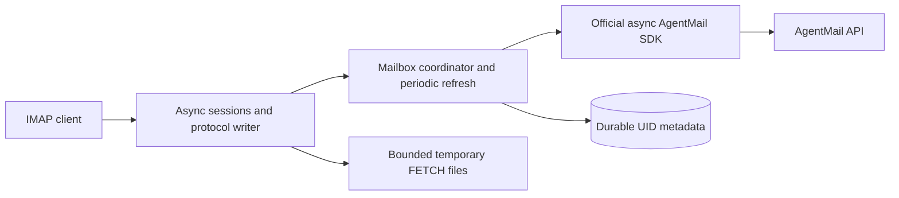
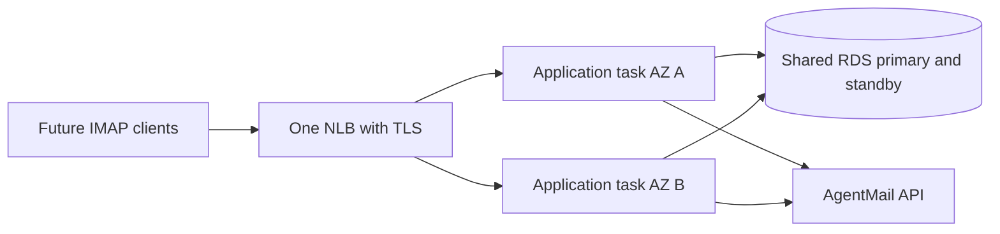

# Local implementation

This folder is self-contained. Run commands from `local/`. Existing private configuration and SQLite state were moved here without resetting identity. The separate AWS implementation lives in `../aws/`.

# AgentMail IMAP bridge

A local asynchronous Python IMAP server for reading AgentMail inboxes with an ordinary mail client. The IMAP username is the inbox ID and the password is that client's API key. The only permitted message mutation is read/unread state. Local traffic defaults to the synthetic Node sandbox; no production credentials are needed.

## Install and run

Requires Python 3.12+ and Node.js 20+. From this checkout:

```sh
python3.12 -m venv .venv
source .venv/bin/activate
python -m pip install -r requirements.lock -e .
cp .env.example .env
```

The server loads `.env` from the current working directory automatically. Exported environment variables override it. `AGENTMAIL_INBOX_ID` and `AGENTMAIL_API_KEY` are example test-client credentials, never a server credential or authentication bypass.

In terminal 1, start the fake API:

```sh
npm --prefix test-harness run api
```

In terminal 2, activate the virtual environment, initialize durable UID state once, and start the server:

```sh
python -m agentmail_imap init-db
python -m agentmail_imap
```

Dependencies pin AgentMail SDK 2.0.6 and HTTPX 0.28.1; `requirements.lock` also pins the tested transitive dependency versions. Initialization refuses to overwrite existing state. Normal starts and restarts use the existing database. The server prints `IMAP ready HOST:PORT` after binding. Stop with Ctrl-C.

## Configuration

All settings below are server settings. Sizes are bytes and times are seconds.

| Variable | Default | Meaning |
| --- | --- | --- |
| `AGENTMAIL_API_URL` | `http://127.0.0.1:3210/v0` | AgentMail SDK API root |
| `IMAP_HOST` | `127.0.0.1` | TCP bind address |
| `IMAP_PORT` | `1143` | TCP port; zero assigns a private ephemeral test port |
| `IMAP_UID_DB` | `var/uids.sqlite3` | Durable UID database |
| `IMAP_TEMP_DIR` | `var/tmp` | Private request staging and short-lived raw cache |
| `IMAP_REFRESH_INTERVAL_SECONDS` | `60` | Selected mailbox refresh interval |
| `IMAP_COMMAND_TIMEOUT_SECONDS` | `300` | Deadline for commands other than FETCH |
| `IMAP_IDLE_TIMEOUT_SECONDS` | `1800` | Inactive session deadline |
| `IMAP_WRITE_TIMEOUT_SECONDS` | `30` | Response write deadline |
| `IMAP_MAX_CONNECTIONS` | `100` | Simultaneous connections |
| `IMAP_MAX_COMMAND_BYTES` | `65536` | Command line bound |
| `IMAP_MAX_LITERAL_BYTES` | `65536` | Incoming command literal bound |
| `IMAP_MAX_MESSAGE_BYTES` | `26214400` | Individual raw message bound |
| `IMAP_MAX_TEMP_BYTES` | `268435456` | Aggregate temporary storage bound |
| `IMAP_MAX_BATCH_BYTES` | `104857600` | Bound for one prepared group or raw SEARCH batch |
| `IMAP_MAX_BATCH_MESSAGES` | `1000` | Prepared group count bound or raw SEARCH batch |
| `IMAP_MAX_DOWNLOADS` | `4` | Global concurrent raw downloads |
| `IMAP_MAX_REFRESHES` | `4` | Concurrent metadata refreshes |
| `IMAP_API_REQUESTS_PER_SECOND` | `5` | Paced API dispatch rate per credential across connections |
| `IMAP_DOWNLOAD_CONCURRENCY` | `2` | Per-credential download and API concurrency |
| `IMAP_FETCH_GROUP_MESSAGES` | `8` | Ordered FETCH group size, also bounded by batch limits |
| `IMAP_METADATA_GROUP_MESSAGES` | `256` | Metadata-only FETCH group size |
| `IMAP_METADATA_AUTH_INTERVAL` | `60` | Seconds between metadata FETCH authorization rechecks |
| `IMAP_RAW_CACHE_BYTES` | `67108864` | Global raw cache bound; zero disables it |
| `IMAP_RAW_CACHE_TTL` | `120` | Cache lifetime in seconds from download completion |
| `IMAP_RETRY_INITIAL` | `1` | Initial retry delay in seconds |
| `IMAP_RETRY_MAX` | `60` | Backoff ceiling; a larger Retry-After is honored |
| `IMAP_ASSUME_FULL_VISIBILITY` | `false` | Explicit full/stable visibility contract for 404 removal reconciliation |
| `IMAP_TLS_MODE` | `local` | `local`, `implicit`, or `terminated` transport |
| `IMAP_TLS_CERT_FILE` | unset | PEM certificate chain for implicit TLS |
| `IMAP_TLS_KEY_FILE` | unset | PEM private key for implicit TLS |
| `IMAP_TLS_HANDSHAKE_TIMEOUT_SECONDS` | `10` | Direct TLS handshake deadline |
| `IMAP_TLS_SHUTDOWN_TIMEOUT_SECONDS` | `5` | Direct TLS shutdown deadline |

SDK internal retries are disabled so every API attempt passes through the shared limiter; each attempt retains a 60-second timeout. API dispatches are spaced across every connection using the same credential, including different inboxes. A 429 or transient upstream/network failure applies shared exponential backoff; Retry-After seconds or dates can extend it. FETCH retries transient failures until successful, disconnected, or shut down, without a whole-command deadline. Other operations make at most three attempts within their command deadline. Permanent failures (including revoked authorization and missing messages) end the command. Signed downloads are concurrency-limited and obey the shared cooldown without consuming API dispatch reservations. Access is checked before every mailbox command, between content FETCH groups, and every 60 seconds during metadata-only FETCH (between complete results); cached-message access is revalidated with fresh metadata. Revocation cannot recall bytes already sent, or undo upstream read-label changes after a disconnected fetch.

## Protocol and message state

To test real API-to-Thunderbird delivery, copy `scripts/mail_test.env.example` to the ignored `.env.mail_test`, set its sender/recipient credentials, and restrict the file to mode 0600. Run `.venv/bin/python -m scripts.send_mail_test --count 100`. This sends real numbered messages at one per second, using one idempotency key per run/message, then verifies received, non-trash messages through the recipient API. Reports in `var/mail-tests/<run-id>.json` contain counts, message IDs and elapsed times, never credentials. A failed/interrupted run can resume with `--run-id <run-id>` within 23 hours; successful sends are skipped and ambiguous retries reuse the same payload/key. Omitting the run ID intentionally starts a new batch. The testcase does not delete messages or reset the UID database. Refresh the recipient account in Thunderbird and search for its `[IMAP Test <run-id>]` subject prefix.

The mailbox is `INBOX`. It includes accessible messages labeled `received` unless they also carry `trash`. Received spam messages remain included. Sent-only and all trash messages are excluded. Listings follow every page before publishing a snapshot. One inbox is bound to each connection; credentials remain isolated across connections. Keys for an inbox are assumed to expose the same message set.

The reading surface includes CAPABILITY, LOGIN and AUTHENTICATE PLAIN, LIST/LSUB, SELECT/EXAMINE, STATUS, FETCH/UID FETCH, SEARCH/UID SEARCH, STORE/UID STORE, NOOP, CHECK, CLOSE, and LOGOUT. FETCH supports sequence and UID sets, flags, internal dates, byte sizes, envelope/MIME structure, BODY sections, header-field subsets, partial ranges, RFC822 aliases, and ALL/FAST/FULL macros. SEARCH supports the implemented IMAP4rev1 flag, date, size, address/header and content predicates, boolean composition, and ASCII/UTF-8 charsets. Unknown syntax receives a controlled failure.

NOOP refresh explicitly reannounces current UID/FLAGS for the selected mailbox, even when the server snapshot already matches upstream, so a client can correct stale cached flags after reconnecting. Periodic refresh continues to send only changed flags.

`BODY.PEEK[...]` preserves Seen. Non-PEEK body retrieval in a read/write selection marks read; EXAMINE preserves state. SELECT offers Seen changes without probing permissions by mutation or requiring key-administration access. A denied update returns NO while PEEK remains usable; EXAMINE explicitly selects read-only mode. STORE accepts only Seen changes, including add/remove/replace and `.SILENT`. Messages without an `unread` label are reflected as Seen; an `unread` label means unseen even if `read` is also present; `starred` is reflected as Flagged but cannot be changed here. Flag replacement is rejected when it would remove a reflected Flagged flag; unrelated upstream labels are preserved.

APPEND, COPY/MOVE, message deletion/EXPUNGE, folder creation/deletion/renaming, and unsupported flag changes are denied. Sending, drafts, STARTTLS, IDLE, and other optional IMAP extensions are excluded. Direct implicit TLS is available as described below; the default plaintext listener is restricted to loopback.

Content FETCH prepares groups of eight concurrently and emits results in ascending mailbox sequence order. Metadata-only FETCH uses groups of 256 and checks authorization by elapsed time instead of once per group. If a later group encounters a transient failure, previously delivered results remain a prefix and the server retries that group before sending later results. A permanent failure returns a tagged failure after any completed prefix. Once transmission starts, a broken literal closes the connection; clients must observe the matching tagged completion to know the command completed. A missing completion does not undo any read-state side effect.

Immutable raw content is cached for up to 120 seconds within a global 64 MiB budget, scoped to namespace, inbox, credential, message ID, size and timestamp. Reuse requires a fresh metadata access check. Expired unpinned files are deleted automatically; active groups pin files until completion. LRU eviction never removes pinned content; cache, in-flight downloads and request files share the aggregate temporary-byte limit. Overflow uses bounded request staging. Shutdown deletes the cache; private per-run directories with dead owner PIDs are cleaned at startup, while live or unmarked directories are preserved. Raw bodies and attachments never enter the UID database.

SELECT, EXAMINE, STATUS, and selected-session NOOP refresh metadata. Mailbox/credential groups coalesce concurrent refreshes into one in-flight scan and refresh periodically while selected, sharing scheduling between matching sessions. Arrival notifications can be sent while idle. Deletions queue until a permitted command boundary; no EXPUNGE is inserted into a FETCH literal or during ordinary FETCH/STORE/SEARCH; UID commands permit queued removals before their results. Failed refreshes preserve the last complete snapshot. NOOP reports failure without publishing partial data; a later successful refresh can recover.

## TLS and authentication

Authentication remains the existing inbox-ID/API-key LOGIN or AUTHENTICATE PLAIN flow. TLS protects that flow; it does not create another account system. Three explicit transport modes are supported:

- `local` (default): plaintext on a loopback address only, preserving the current localhost test setup.
- `implicit`: the application accepts TLS from the first byte, requires a certificate/private-key pair, and allows TLS 1.2 or newer. It never falls back to plaintext when certificate loading fails. The default port is 1993 if IMAP_PORT is unset; use 993 for an eventual public endpoint with a valid hostname certificate.
- `terminated`: plaintext application listener for a private network behind a TLS-terminating proxy/NLB. This configuration is an explicit operator assertion; the application cannot prove that an upstream connection was encrypted. Restrict network access to the proxy with security groups. Do not expose this backend publicly. The future NLB listener uses TLS on 993 and forwards to the private application port. No AWS listener has been created.

For local automated TLS testing, the suite generates a two-day localhost certificate in its temporary workspace and explicitly trusts it in the test client. It verifies encrypted authentication/raw retrieval/read-state updates, rejection of an untrusted certificate, and rejection of plaintext before authentication. It does not modify the system or Thunderbird trust store.

To create separate development certificate files and start direct TLS manually:

```sh
python scripts/create_test_certificate.py --directory var/tls-test
IMAP_TLS_MODE=implicit IMAP_PORT=1993 \
  IMAP_TLS_CERT_FILE=var/tls-test/localhost.crt \
  IMAP_TLS_KEY_FILE=var/tls-test/localhost.key \
  python -m agentmail_imap
```

This test certificate is self-signed and is not trusted by Thunderbird. For a real TLS client connection, provide a certificate trusted by the client and matching the hostname; use SSL/TLS and Normal password in Thunderbird. Keep the currently running 1143 connection unchanged until you deliberately configure and start a TLS listener. Private keys are excluded from Git. STARTTLS is not advertised or implemented; TLS mode requires an implicit-TLS client.

## UID state and recovery

SQLite stores mailbox identity, UIDVALIDITY, next-UID counters, and message-ID/UID mappings with active/retired membership. UIDs are committed before exposure, survive disconnects and restart, and are never reused. Removal retires membership; reappearance allocates a higher UID. The database contains compact metadata, never email contents or client keys.

Database loss/corruption stops affected operations. Initialization is explicit and normal startup never silently rebuilds identity. Preserve the existing database when investigating failures. Create a consistent backup with `python -m agentmail_imap backup-db --destination /absolute/path/backup.sqlite3`; a filesystem copy of a live SQLite database is not a consistent backup. To restore, stop the server, preserve the damaged database and WAL/SHM files separately, copy a verified backup into `IMAP_UID_DB`, and start against the restored state. If exposed identity continuity is uncertain, run `python -m agentmail_imap reset-db --previous-uidvalidity N` while the server is stopped, where `N` is the greatest previously exposed generation. This deliberately retires the restored mappings and selects a newer generation. Lost state without a usable backup requires explicit initialization followed by this generation reset before startup. A verified restore preserving every exposed UID can preserve identity; an uncertain or older restore requires deliberate generation reset and clients must resynchronize. Keep backups outside raw-message staging directories.

Upstream pagination is not a transactional snapshot. The bridge validates full scans and removal candidates but cannot promise correctness against arbitrary changes between upstream pages. By default, an ambiguous missing-message 404 fails synchronization rather than retiring a globally shared UID. Enable `IMAP_ASSUME_FULL_VISIBILITY=true` only when every credential used for an inbox has the same full, stable message visibility, including all protected-label read permissions. This is an operator assertion, not a permission discovery mechanism: the server does not require API-key administration or prove that the assertion remains true. Under this contract, a complete successful listing followed by a targeted metadata 404 and renewed inbox authorization retires the missing membership. Permission changes violate the contract and can otherwise look like deletion; disable this mode before using narrower credentials. A retired UID stays in SQLite and is never reused; UIDNEXT and UIDVALIDITY remain unchanged on removal. Reappearance receives a new higher UID. Newly selected clients see the reconciled membership; already selected clients receive queued EXPUNGE at a permitted command boundary. Temporary errors and incomplete scans never retire mappings. Adding trash removes a message from INBOX even when received remains; removing trash restores membership with a new UID. Adding spam while retaining received does not remove an accessible message. Immutable size/timestamp changes are rejected while a prior session snapshot exists; identity-only storage cannot detect such changes across a cold restart, so upstream message immutability remains an assumption. Different visibility subsets for keys are outside the supported model. The integration suite checks two simultaneous clients against one synthetic inbox. No local benchmark establishes 10,000-connection capacity.

## Checks and manual exchange

```sh
npm --prefix test-harness test
python -m unittest discover -s tests -v
python scripts/smoke_test.py
```

The harness tests validate the fake API. Protocol/unit tests validate server behavior. The smoke command launches its own API and server on ephemeral ports with a private temporary database, exports independent fixture bytes, checks exact literals, pagination, read changes, periodic/NOOP arrivals, and restart identity, then terminates only owned children and removes its workspace. It never resets or kills a manually started sandbox.

For an illustrative manual exchange, connect with `nc 127.0.0.1 1143` and send these commands with actual CRLF terminators:

```text
A1 CAPABILITY
A2 LOGIN "candidate@imap.test" "test_agentmail_key"
A3 LIST "" "*"
A4 SELECT INBOX
A5 UID FETCH 1:* (UID FLAGS INTERNALDATE RFC822.SIZE)
A6 UID FETCH 1:* (UID BODY.PEEK[])
A7 NOOP
A8 LOGOUT
```

Netcat and terminal newline behavior varies; the scripted smoke command is the dependable byte-correct check.

Create a fresh synthetic Thunderbird profile with `python scripts/thunderbird_profile.py --port 1143 --profile var/thunderbird-profile`. The script refuses an existing profile and prints the separate `--new-instance` launch command. Enter `test_agentmail_key` when prompted. The profile uses plaintext IMAP on loopback, normal password authentication, headers first, contents on opening, and disabled full offline synchronization. No SMTP account is configured. Keep your existing Thunderbird profile open and untouched. The historical [Thunderbird 156.0.1 capture](artifacts/thunderbird-capture-2026-09-29/README.md) used a disposable PREAUTH listener. It proves observed discovery/header command forms only, and does not establish authentication, full-message/attachment opening, read/unread changes, or reconnect acceptance for this implementation. Manual testing of the actual implementation confirmed normal login, four-message sandbox INBOX population, body and hello.txt attachment opening, read/unread API changes, client reconnect, arrival discovery on Get Messages, and stable five-message identity after a server restart. The server detected arrivals periodically, but Thunderbird displayed the new arrival only after Get Messages; immediate idle display remains unverified. The user also reported successful connection to a real AgentMail inbox; comprehensive hosted permission/failure testing remains outstanding. Configure username as the inbox ID and password as its API key; the server never substitutes the example environment credentials. When switching from the sandbox to AgentMail, set `AGENTMAIL_API_URL=https://api.agentmail.to/v0` and restart the bridge, then enter the corresponding inbox ID/key in Thunderbird. The mailbox API environment is part of durable UID identity, so sandbox and hosted mappings remain distinct.

## Architecture and future deployment



One local Python process owns all components and SQLite. Future deployment is separate work: two complete ECS/Fargate tasks across two Availability Zones, one Network Load Balancer, and shared RDS PostgreSQL with one primary and one standby. Public deployment needs TLS, protected networking, coordinated UID allocation/refresh ownership, backups, drain behavior, and measured capacity. No AWS resources or deployment automation are included.



Code and tests were generated with Codex against the supplied handoff, independent synthetic fixtures, and the official SDK; no third-party IMAP server implementation was copied. References: [assignment](ASSIGNMENT.md), [API/protocol resources](API_RESOURCES.md), [final implementation plan](IMPLEMENTATION_PLAN.md), [IMAP4rev1 RFC 3501](https://www.rfc-editor.org/rfc/rfc3501), and [AgentMail documentation](https://docs.agentmail.to/).

The bundled [AWS starter template](../aws/website-template/README.md) provisions a static website on S3/CloudFront, with Route53 DNS and ACM TLS. It does not currently host the Python IMAP service. Its deployment commands are future work and have not been run.

## Failure/load checks and connection keepalives

```sh
# From this package directory, with its dependencies installed:
python -m scripts.failure_load_test --clients 50 --messages 1000 --rounds 3 --output artifacts/failure-load-evidence.json
```

The runner owns synthetic localhost subprocesses and fresh temporary state. See [recorded evidence and limits](../docs/failure-load-evidence.md) and [the function/decision reference](../ABHINAVCHOICES.md). TCP probes default to 60-second idle, 20-second interval, three attempts; idle IMAP heartbeats default to 120 seconds. Both copies expose the corresponding settings in `.env.example`. Heartbeats never interrupt command output or reset the client inactivity timeout.
